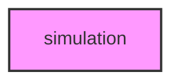

# SIMULATION

## Overview
Functionality for simulation.

## 📦 Contents
- `[_common.py](_common.py)`
- `[run_simulation.py](run_simulation.py)`
- `[simulate_core.py](simulate_core.py)`
- `[simulate_dna.py](simulate_dna.py)`
- `[simulate_ecology.py](simulate_ecology.py)`
- `[simulate_epigenome.py](simulate_epigenome.py)`
- `[simulate_gwas.py](simulate_gwas.py)`
- `[simulate_information.py](simulate_information.py)`
- `[simulate_life_events.py](simulate_life_events.py)`
- `[simulate_math.py](simulate_math.py)`
- `[simulate_ml.py](simulate_ml.py)`
- `[simulate_multiomics.py](simulate_multiomics.py)`
- `[simulate_networks.py](simulate_networks.py)`
- `[simulate_ontology.py](simulate_ontology.py)`
- `[simulate_phenotype.py](simulate_phenotype.py)`
- `[simulate_protein.py](simulate_protein.py)`
- `[simulate_quality.py](simulate_quality.py)`
- `[simulate_rna.py](simulate_rna.py)`
- `[simulate_singlecell.py](simulate_singlecell.py)`
- `[simulate_visualization.py](simulate_visualization.py)`

## 📊 Structure



## Usage
Import module:
```python
from metainformant.simulation import ...
```
