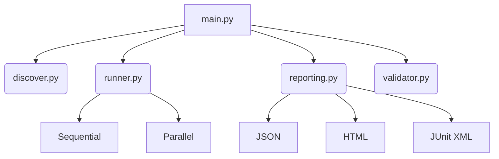

# SPEC: Test Examples Runner

Technical specification for the reference script test framework.

## Design Goals

1. **Discoverable**: Automatically find all `examples/*.py` scripts.
2. **Parallel**: Support concurrent execution for speed.
3. **CI-Ready**: Generate JUnit XML for GitHub Actions, GitLab CI, etc.
4. **Human-Readable**: Produce HTML reports with pass/fail status.

## Architecture

## Key Behaviors

- **Exit Codes**: `0` if all pass, `1` if any fail.
- **Timeouts**: Individual examples have configurable timeouts.
- **Filtering**: Use `--domain` to run only a subset.

## Related Documentation

- **README**: [README.md](README.md)
- **AGENTS**: [AGENTS.md](AGENTS.md)
- **Parent Spec**: [scripts/SPEC.md](../SPEC.md)
- **Test Suite Spec**: [tests/SPEC.md](../../tests/SPEC.md)
