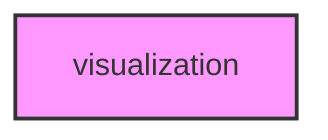

# VISUALIZATION

## Overview
Functionality for visualization.

## Contents
- `[run_visualization.py](run_visualization.py)`

## Structure


```mermaid
graph TD
    visualization[visualization]
    style visualization fill:#f9f,stroke:#333,stroke-width:2px
```

## Usage
Import module:
```python
from metainformant.visualization import ...
```
