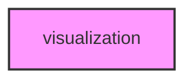

# VISUALIZATION

## Overview
Functionality for visualization.

## 📦 Contents
- `[run_visualization.py](run_visualization.py)`

## 📊 Structure



## Usage
Import module:
```python
from metainformant.visualization import ...
```
