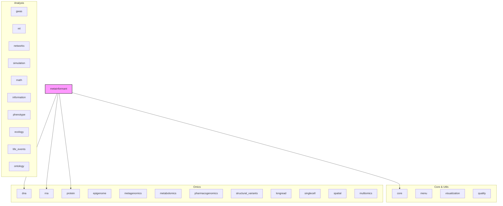

# METAINFORMANT

## Overview

METAINFORMANT: Comprehensive Bioinformatics Toolkit for Multi-Omic Analysis.

## 📦 Contents

- **[core/](core/)**
- **[dna/](dna/)**
- **[ecology/](ecology/)**
- **[epigenome/](epigenome/)**
- **[gwas/](gwas/)**
- **[information/](information/)**
- **[life_events/](life_events/)**
- **[longread/](longread/)**
- **[math/](math/)**
- **[menu/](menu/)**
- **[metabolomics/](metabolomics/)**
- **[metagenomics/](metagenomics/)**
- **[ml/](ml/)**
- **[multiomics/](multiomics/)**
- **[networks/](networks/)**
- **[ontology/](ontology/)**
- **[pharmacogenomics/](pharmacogenomics/)**
- **[phenotype/](phenotype/)**
- **[protein/](protein/)**
- **[quality/](quality/)**
- **[rna/](rna/)**
- **[simulation/](simulation/)**
- **[singlecell/](singlecell/)**
- **[spatial/](spatial/)**
- **[structural_variants/](structural_variants/)**
- **[visualization/](visualization/)**
- `[__init__.py](__init__.py)`
- `[__main__.py](__main__.py)`

## 📊 Structure



## Usage

Import modules directly:

```python
from metainformant import dna, rna, protein
from metainformant.gwas.analysis import association
from metainformant.longread.workflow.orchestrator import LongReadOrchestrator
```
