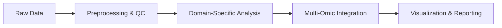

# MetaInformAnt Technical Specification

MetaInformAnt is a comprehensive bioinformatics toolkit for multi-domain analysis, designed for modularity, performance, and scientific rigor.

## Architecture

MetaInformAnt follows a modular, domain-driven architecture. Each module is self-contained with its own tests and documentation.

### Core Modules

- **`metainformant.core`**: Shared infrastructure for I/O, logging, configuration, and parallel processing.
- **`metainformant.dna`**: Genomic analysis, alignment, and population genetics.
- **`metainformant.rna`**: Transcriptomic workflows and Amalgkit integration.
- **`metainformant.protein`**: Proteomic analysis and structure modeling.
- **`metainformant.gwas`**: Genome-wide association studies workflow.

### Advanced Modules

- **`metainformant.math`**: Mathematical biology models and population genetics theory.
- **`metainformant.ml`**: Machine learning pipelines for biological data.
- **`metainformant.networks`**: Biological network analysis and community detection.
- **`metainformant.information`**: Information theory measures for omic data.
- **`metainformant.phenotype`**: Trait analysis and phenotype curation.

## Implementation Standards

### Triple Play Documentation
Every module must contain:
1. **`README.md`**: User-facing documentation and examples.
2. **`AGENTS.md`**: Documentation for AI agents, including function indices.
3. **`SPEC.md`**: Technical specification and design decisions.

### Testing Policy
- **No Mocking**: Tests must use real, functional methods. stubs or mocks are prohibited.
- **Pytest**: All tests are authored using `pytest`.
- **UV**: Dependencies and environments are managed via `uv`.

### Output Management
- All program-generated results must be written to the `output/` directory by default.
- `output/` is ephemeral and should not contain documentation or core project files.

## Data Flows

The toolkit is designed to support end-to-end workflows from raw data (FASTQ/VCF) to scientific insights (visualizations/reports).

