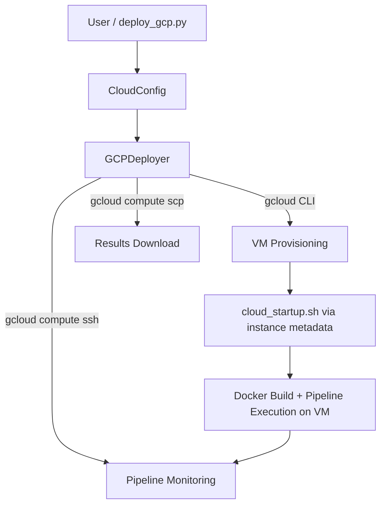

# Cloud Module

GCP VM lifecycle management for METAINFORMANT pipeline workloads.

## Overview

The `metainformant.cloud` module creates, monitors, and tears down Google Cloud
Compute Engine VMs that run the amalgkit RNA-seq pipeline at scale. It shells
out to the `gcloud` CLI via `subprocess` — no Google Cloud Python SDK is
required.

## Table of Contents

- [Architecture](#architecture)
- [Key Components](#key-components)
  - [CloudConfig (`cloud_config.py`)](#cloudconfig-cloud_configpy)
  - [GCPDeployer (`gcp_deployer.py`)](#gcpdeployer-gcp_deployerpy)
- [Workflow Example: RNA-seq on Cloud](#workflow-example-rna-seq-on-cloud)
- [CLI](#cli)
- [Cost Optimization](#cost-optimization)
- [Troubleshooting](#troubleshooting)
- [See Also](#see-also)

## Architecture



## Key Components

### CloudConfig (`cloud_config.py`)

Configuration for a GCP compute instance running the pipeline:

```python
from metainformant.cloud import CloudConfig

config = CloudConfig(
    project="my-gcp-project",
    zone="us-central1-a",
    machine_type="n2-highcpu-96",
    disk_size_gb=500,
    spot=True,
)
errors = config.validate()  # list of validation errors ([] when valid)
```

**Configuration Fields:**

| Field | Type | Default | Description |
|-------|------|---------|-------------|
| `project` | str | `""` | GCP project ID (required; `validate()` enforces) |
| `zone` | str | `us-central1-a` | GCP zone |
| `instance_name` | str | `metainformant-pipeline` | VM instance name |
| `machine_type` | str | `n2-highcpu-96` | Compute Engine machine type |
| `disk_size_gb` | int | `500` | Boot disk size in GB (`validate()` warns below 100) |
| `local_ssd_count` | int | `0` | Number of attached NVMe local SSDs |
| `spot` | bool | `True` | Spot pricing with `STOP` on termination |
| `max_gb` | float | `20.0` | Max sample size in GB for the pipeline |
| `workers` | int | `80` | Parallel download/quant workers |
| `threads` | int | `96` | Total CPU threads for the pipeline |
| `gcs_bucket` | str | `""` | Optional GCS bucket for result sync |
| `repo_url` | str | MetaInformAnt GitHub URL | Git URL cloned on the VM |
| `repo_branch` | str | `main` | Git branch checked out on the VM |
| `docker_image` | str | `metainformant-pipeline` | Docker image built on-VM |
| `service_account_email` | str | `""` | Optional service account for the VM |
| `config_dir` / `output_dir` | str | `config/amalgkit` / `output/amalgkit` | Pipeline paths |
| `image_family` / `image_project` | str | `debian-12` / `debian-cloud` | Boot image |

**Methods:**

| Member | Description |
|--------|-------------|
| `startup_script_path` | Property: `Path` to `scripts/cloud/cloud_startup.sh` |
| `validate()` | Returns a list of validation error strings (empty = valid) |
| `to_metadata()` | Pipeline params as GCP instance metadata key-value pairs |

### GCPDeployer (`gcp_deployer.py`)

VM lifecycle management via the `gcloud` CLI:

```python
from metainformant.cloud import CloudConfig, GCPDeployer

deployer = GCPDeployer(CloudConfig(project="my-gcp-project"))

cmd = deployer.create_vm(dry_run=True)   # preview the full gcloud command
deployer.full_deploy()                   # create VM, wait up to 5 min for SSH
deployer.get_vm_status()                 # describe → dict ({"status": "NOT_FOUND"} if absent)
deployer.get_pipeline_status()           # remote progress via SSH
deployer.tail_logs(lines=50)             # docker logs from the pipeline container
deployer.sync_to_gcs()                   # requires cfg.gcs_bucket
deployer.download_results("output/amalgkit")
deployer.stop_vm()                       # -> bool
deployer.start_vm()                      # -> bool
deployer.delete_vm()                     # deletes VM and all disks
```

**Methods:**

| Method | Description |
|--------|-------------|
| `gcloud_installed()` | Static: `True` if `gcloud` is on `PATH` |
| `create_vm(dry_run=False)` | Create the VM with the startup script and metadata; returns instance dict (or dry-run command dict) |
| `delete_vm()` | Delete VM and disks; `True` on success |
| `stop_vm()` / `start_vm()` | Stop (keep) / start the VM; `True` on success |
| `get_vm_status()` | `gcloud compute instances describe` JSON as dict |
| `get_pipeline_status()` | SSH: run `scripts/rna/check_pipeline_status.py` on the VM |
| `tail_logs(lines=50)` | SSH: tail the `metainformant-pipeline` container logs |
| `get_startup_log()` | SSH: read the VM startup-script log |
| `download_results(local_dir="output/amalgkit")` | Run `scripts/cloud/download_results.sh` (direct `gcloud scp` fallback) |
| `sync_to_gcs()` | SSH: `gsutil -m rsync` project output to `gs://<bucket>/amalgkit/` |
| `wait_for_ssh(max_wait=300)` | Poll SSH every 10 s until ready or timeout |
| `full_deploy()` | Create VM, wait for SSH, return `{"vm", "ssh_ready", "status"}` |

## Workflow Example: RNA-seq on Cloud

```python
from metainformant.cloud import CloudConfig, GCPDeployer

config = CloudConfig(
    project="my-gcp-project",
    workers=80,
    threads=96,
    gcs_bucket="my-results-bucket",
)
deployer = GCPDeployer(config)

result = deployer.full_deploy()          # VM boots; startup script starts the pipeline
print(result["ssh_ready"], result["status"])

deployer.get_pipeline_status()           # poll progress
deployer.download_results("output/amalgkit")
deployer.delete_vm()
```

## CLI

`scripts/cloud/deploy_gcp.py` wraps the deployer:

```bash
python scripts/cloud/deploy_gcp.py deploy --project my-project [options]
python scripts/cloud/deploy_gcp.py status --project my-project
python scripts/cloud/deploy_gcp.py logs --lines 50
python scripts/cloud/deploy_gcp.py startup-log
python scripts/cloud/deploy_gcp.py download --output output/amalgkit
python scripts/cloud/deploy_gcp.py stop | start | destroy
```

Supporting scripts live in `scripts/cloud/` (`cloud_startup.sh`,
`download_results.sh`, `install_gcloud.sh`, `vm_setup.sh`, `prep_genomes.py`).

## Cost Optimization

`CloudConfig.spot` defaults to `True`, which provisions the VM with
`--provisioning-model SPOT --instance-termination-action STOP`. The default
`n2-highcpu-96` shape is sized for the 96-thread pipeline default.

## Troubleshooting

| Symptom | Check |
|---------|-------|
| `gcloud CLI not found` on deploy | Run `bash scripts/cloud/install_gcloud.sh` |
| VM created but SSH never ready | `deployer.get_startup_log()`; check firewall allows TCP:22 |
| Pipeline not progressing | `deployer.get_pipeline_status()`; container logs via `deployer.tail_logs()` |
| `create_vm` raises `Invalid config` | Inspect `CloudConfig.validate()` errors (missing project, small disk, workers/threads < 1) |

## See Also

- **Documentation**: [docs/cloud/index.md](../../../docs/cloud/index.md)
- **API Reference**: [SPEC.md](SPEC.md)
- **RNA Pipeline**: [../rna/](../rna/)
- **GWAS Pipeline**: [../gwas/](../gwas/)
- **Mothership**: [README.md](../README.md)
