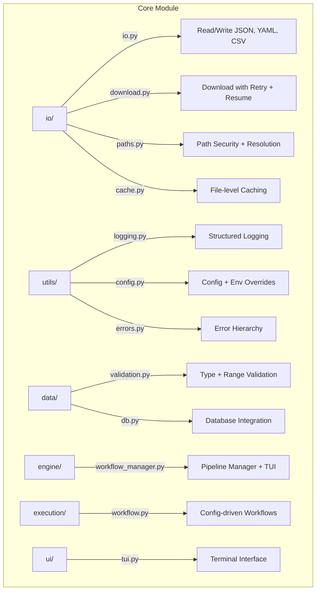

# Core Module

Shared infrastructure for METAINFORMANT: I/O, configuration, validation, logging, workflow execution, and TUI.

## Architecture



## Submodules

| Module | Purpose |
|--------|---------|
| [`io/`](io/) | File I/O (JSON, YAML, CSV), gzip support, downloads, caching, atomic writes |
| [`utils/`](utils/) | Logging, config loading, error types, hashing, progress bars, text helpers |
| [`data/`](data/) | Input validation (`validate_range`, `validate_type`) and database access |
| [`engine/`](engine/) | `BasePipelineManager` with TUI visualization, `PipelineItem`, `Stage` lifecycle |
| [`execution/`](execution/) | Config-driven workflow execution with `validate_config_file` |
| [`ui/`](ui/) | `TerminalInterface` for real-time pipeline monitoring |
| [`output/`](output/) | Discovery cache and output management |

## Key Capabilities

### File I/O (gzip-aware, atomic)

```python
from metainformant.core.io import io

data = io.load_json("config/settings.json")       # auto-detects .gz
io.dump_json(result, "output/result.json.gz")      # atomic write + gzip
config = io.load_yaml("config/workflow.yaml")
io.dump_csv(rows, "output/data.csv", header=["id", "value"])
```

### Path Security and Configuration

```python
from metainformant.core.io import paths
from metainformant.core.utils import config

resolved = paths.expand_and_resolve("~/data/input.txt")
safe = paths.is_within(resolved, parent="/allowed/dir")

cfg = config.load_mapping_from_file("config/workflow.yaml")
cfg = config.apply_env_overrides(cfg, prefix="RNA")
```

### Pipeline Orchestration

```python
from metainformant.core.engine.workflow_manager import BasePipelineManager, PipelineItem, Stage

manager = BasePipelineManager(name="my-pipeline", max_workers=4)
items = [PipelineItem(item_id=s) for s in ["SRR001", "SRR002"]]
manager.run(items, phases=["download", "process", "merge"])
```

## Quick Start

```python
from metainformant.core.utils.logging import get_logger
from metainformant.core.io import io, paths
from metainformant.core.data import validation

logger = get_logger(__name__)

# Load config, validate inputs, write results
cfg = io.load_yaml("config/analysis.yaml")
validation.validate_not_empty(cfg.get("species"), "species")

result = {"status": "complete", "n_samples": 42}
io.dump_json(result, "output/analysis/result.json", indent=2)
```

## Related

- [metainformant.rna](../rna/) - RNA workflow engine built on core pipeline
- [metainformant.visualization](../visualization/) - Plotting uses core I/O
- [config/](../../../config/) - Configuration files loaded by `config.load_mapping_from_file`
- [docs/core/](../../../docs/core/) - Core documentation
