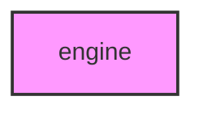

# ENGINE

## Overview
Core engine module for workflow orchestration.

## 📦 Contents
- `[__init__.py](__init__.py)`
- `[workflow_manager.py](workflow_manager.py)`

## 📊 Structure



## Usage
Import module:
```python
from metainformant.metainformant.core.engine import ...
```
