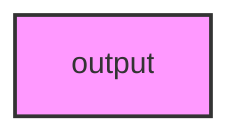

# OUTPUT

## Overview
Functionality for output.

## 📦 Contents


## 📊 Structure


```mermaid
graph TD
    output[output]
    style output fill:#f9f,stroke:#333,stroke-width:2px
```

## Usage
Import module:
```python
from metainformant.metainformant.core.output import ...
```
