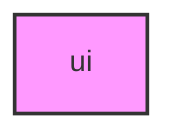

# UI

## Overview
Core UI utilities for METAINFORMANT.

## 📦 Contents
- `[__init__.py](__init__.py)`
- `[tui.py](tui.py)`

## 📊 Structure



## Usage
Import module:
```python
from metainformant.metainformant.core.ui import ...
```
