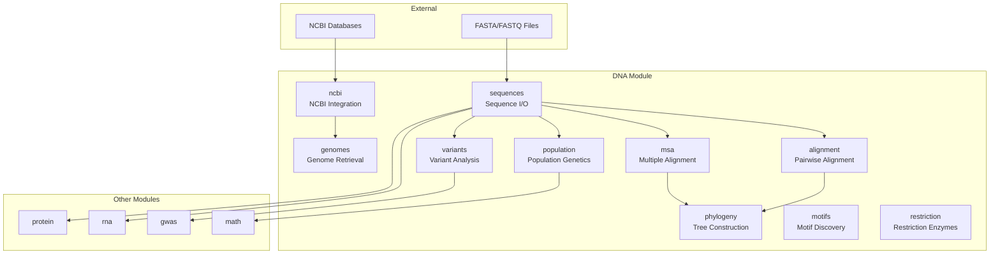
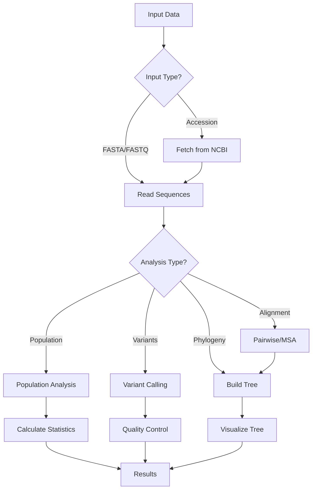

# DNA Analysis Module

The `dna` module provides tools for DNA sequence analysis, from sequence manipulation to population genetics and phylogenetics. This module handles DNA sequences in various formats and provides operations and analytical pipelines.

## Overview

This module covers the full spectrum of DNA analysis needs:
- **Sequence I/O**: Reading and writing DNA sequences in multiple formats
- **Alignment**: Pairwise and multiple sequence alignment algorithms
- **Phylogenetics**: Tree construction and analysis
- **Population Genetics**: Diversity metrics and evolutionary analysis
- **Genomic Data**: NCBI integration and genome retrieval
- **Molecular Biology**: Restriction enzymes, motifs, and translation

### Module Architecture



### DNA Analysis Workflow



## Submodules

### Sequence I/O (`sequences.py`)
Core sequence reading, writing, and manipulation utilities.

**Key Features:**
- FASTA/FASTQ format support
- Sequence validation and quality control
- Format conversion and standardization
- Memory-efficient processing of large files

**Usage:**
```python
from metainformant.dna import sequences

# Read sequences from file
seqs = sequences.read_fasta("sequences.fasta")

# Write sequences in different formats
sequences.write_fasta(seqs, "output.fasta")
sequences.write_fastq(seqs, "output.fastq")

# Sequence manipulation
seq = sequences.clean_sequence("ATCGATCG")  # Remove non-DNA characters
rev = sequences.reverse_complement(seq)
```

### Genomic Data (`genomes.py`, `ncbi.py`, `entrez.py`)
Tools for retrieving and working with genomic data from public databases.

**Key Features:**
- NCBI Datasets API integration
- Entrez query construction and execution
- Genome accession validation and retrieval
- Metadata extraction and parsing

**Usage:**
```python
from metainformant.dna import genomes, ncbi, entrez

# Validate and retrieve genome data
accession = genomes.validate_accession("GCF_000001405.40")
genome_data = ncbi.download_genome(accession)

# Search and retrieve sequences
query = entrez.build_query("Homo sapiens", "mRNA")
results = entrez.search(query)
```

### Alignment (`alignment.py`, `msa.py`)
Pairwise and multiple sequence alignment algorithms.

**Key Features:**
- Global and local alignment algorithms
- Multiple sequence alignment (progressive method)
- Alignment scoring and evaluation
- Gap penalty optimization

**Usage:**
```python
from metainformant.dna import alignment, msa

# Pairwise alignment
seq1 = "ATCGATCG"
seq2 = "ATCGATCG"
aln = alignment.global_align(seq1, seq2)
print(f"Score: {aln.score}")

# Multiple sequence alignment
sequences = {"seq1": "ATCG", "seq2": "ATCG", "seq3": "ATCG"}
msa_result = msa.progressive_align(sequences)
```

### Phylogenetics (`phylogeny.py`)
Phylogenetic tree construction and analysis.

**Key Features:**
- Neighbor-joining tree construction
- Distance matrix computation
- Newick format I/O
- Tree visualization support

**Usage:**
```python
from metainformant.dna import phylogeny

# Build phylogenetic tree
tree = phylogeny.neighbor_joining_tree(sequences)
newick_string = phylogeny.to_newick(tree)

# Parse existing trees
parsed_tree = phylogeny.from_newick(newick_string)
```

### Population Genetics (`population.py`)
Population genetic analysis and diversity metrics.

**Key Features:**
- Nucleotide diversity (π) calculation
- Tajima's D statistic
- Fst (fixation index) computation
- Haplotype analysis
- Population structure inference

**Usage:**
```python
from metainformant.dna import population

# Diversity metrics
sequences = ["ATCGATCG", "ATCGATCG", "ATCGATCG"]
pi = population.nucleotide_diversity(sequences)
tajima_d = population.tajimas_d(sequences)

# Population differentiation
fst = population.fst(population1_sequences, population2_sequences)
```

### Sequence Quality (`fastq.py`)
FASTQ format processing and quality analysis.

**Key Features:**
- Quality score parsing and analysis
- Read filtering and trimming
- Quality report generation
- Format validation and conversion

**Usage:**
```python
from metainformant.dna import fastq

# Quality analysis
avg_quality = fastq.average_phred_by_position("reads.fastq")

# Iterate through FASTQ records
for read_id, seq, qual in fastq.iter_fastq("reads.fastq"):
    # Process each read
    pass
```

### Motif Analysis (`motifs.py`)
DNA motif discovery and analysis.

**Key Features:**
- Motif scanning and detection
- Position weight matrix construction
- Motif enrichment analysis
- Transcription factor binding site prediction

**Usage:**
```python
from metainformant.dna import motifs

# Find motif positions in sequence (supports IUPAC codes)
positions = motifs.find_motif_positions("ATCGGATCGG", "ATCG")

# Find multiple motifs
from metainformant.dna.sequences import find_motifs
motif_positions = find_motifs(sequence, ["ATCG", "GCAT"])
```

### Restriction Enzymes (`restriction.py`)
Restriction enzyme analysis and virtual digestion.

**Key Features:**
- Enzyme database and lookup
- Virtual restriction digest
- Fragment analysis and sizing
- Enzyme compatibility checking

**Usage:**
```python
from metainformant.dna import restriction

# Find restriction sites
sequence = "ATCGATCG"
enzyme_motifs = {"EcoRI": "GAATTC", "BamHI": "GGATCC"}
sites = restriction.find_restriction_sites(sequence, enzyme_motifs)
# Returns: {"EcoRI": [positions], "BamHI": [positions]}
```

### Genetic Variants (`variants.py`)
SNP and variant detection and analysis.

**Key Features:**
- Variant calling from alignments
- VCF format I/O
- Variant annotation and filtering
- Population variant analysis

**Usage:**
```python
from metainformant.dna import variants

# Parse VCF file (basic parsing)
vcf_info = variants.parse_vcf("variants.vcf")
# Returns: {"samples": [...], "num_variants": count}

# For full VCF parsing and variant calling, use gwas module
from metainformant.gwas import parse_vcf_full, apply_qc_filters
```

### Molecular Biology (`transcription.py`, `translation.py`, `codon.py`)
DNA transcription, translation, and codon analysis.

**Key Features:**
- DNA to RNA transcription
- RNA to protein translation
- Codon usage analysis
- Genetic code handling
- ORF detection

**Usage:**
```python
from metainformant.dna import transcription, translation, codon

# Transcription and translation
dna = "ATCGATCG"
rna = transcription.transcribe(dna)
protein = translation.translate(rna)

# Codon analysis
usage = codon.codon_usage(dna_sequences)
```

### Sequence Composition (`composition.py`)
DNA sequence composition analysis.

**Key Features:**
- GC content calculation
- Dinucleotide and trinucleotide frequencies
- Sequence complexity metrics
- Compositional bias detection

**Usage:**
```python
from metainformant.dna import composition

# Composition analysis
gc_content = composition.gc_content(sequence)
dinucleotides = composition.dinucleotide_freq(sequence)
```

### Consensus Sequences (`consensus.py`)
Consensus sequence generation and analysis.

**Key Features:**
- Multiple sequence consensus generation
- Consensus quality scoring
- Ambiguity code handling
- Consensus-based variant detection

**Usage:**
```python
from metainformant.dna import consensus

# Generate consensus
sequences = ["ATCG", "ATCG", "ATCG"]
cons_seq = consensus.generate_consensus(sequences)
```

### Evolutionary Distances (`distances.py`)
Evolutionary distance estimation between sequences.

**Key Features:**
- Jukes-Cantor distance
- Kimura 2-parameter distance
- Tamura-Nei distance
- Distance matrix construction

**Usage:**
```python
from metainformant.dna import distances

# Distance calculation
dist = distances.kimura_distance(seq1, seq2)
matrix = distances.distance_matrix(sequences)
```

### Mutation Analysis (`mutations.py`)
Mutation detection and characterization.

**Key Features:**
- Mutation type classification (transition/transversion)
- Mutation rate estimation
- Mutation spectrum analysis
- Mutation burden assessment

**Usage:**
```python
from metainformant.dna import mutations

# Mutation analysis
mutation_types = mutations.classify_mutations(reference, query)
spectrum = mutations.mutation_spectrum(mutation_data)
```

## Integration with Other Modules

The DNA module integrates seamlessly with other METAINFORMANT modules:

### With RNA Module
```python
from metainformant.dna import translation

# Translate DNA to protein
protein_seq = translation.translate_dna(dna_sequence)

# RNA expression analysis uses RNA workflow module
# See RNA module documentation for expression analysis
```

### With Visualization Module
```python
from metainformant.dna import phylogeny
from metainformant.visualization import plot_phylo_tree
import matplotlib.pyplot as plt

# Visualize phylogenetic trees
tree = phylogeny.neighbor_joining_tree(sequences)
ax = plot_phylo_tree(tree)
ax.figure.savefig("tree.png", dpi=300)
plt.close(ax.figure)
```

### With Population Genetics
```python
from metainformant.dna import population, variants

# Integrated population analysis
diversity = population.nucleotide_diversity(sequences)
vcf_info = variants.parse_vcf("variants.vcf")
# For full variant analysis, use gwas module
```

### With GWAS Module
```python
from metainformant.dna import variants, sequences
from metainformant.gwas import parse_vcf_full, apply_qc_filters, association_test_linear

# Variant calling and analysis workflow
# Parse VCF from variant calling
vcf_data = parse_vcf_full("variants.vcf")

# Apply quality control filters
qc_variants = apply_qc_filters(
    vcf_data,
    maf_threshold=0.05,
    missing_threshold=0.1,
    hwe_threshold=1e-6
)

# Use DNA sequences for variant annotation
reference_sequences = sequences.read_fasta("reference.fasta")

# Extract variant information for association testing
# Prepare genotype matrix from VCF data
genotype_matrix = extract_genotypes(qc_variants)
phenotypes = np.array([...])  # Trait values

# Association testing
association_results = association_test_linear(
    genotype_matrix,
    phenotypes,
    covariates=None
)

# Analyze significant variants
significant_variants = association_results[association_results["p_value"] < 1e-5]
```

### With Information Theory Module
```python
from metainformant.dna import sequences, composition
from metainformant.information import shannon_entropy, mutual_information, information_content
import numpy as np

# Sequence entropy and information content analysis
dna_seqs = sequences.read_fasta("sequences.fasta")

# Calculate sequence entropy for each sequence
for seq_id, seq in dna_seqs.items():
    # Calculate k-mer frequencies
    kmers = composition.kmer_frequencies(seq, k=3)
    # Convert to probabilities
    kmer_probs = np.array([kmers.get(kmer, 0) for kmer in sorted(kmers.keys())])
    kmer_probs = kmer_probs / kmer_probs.sum()
    
    # Calculate Shannon entropy
    entropy = shannon_entropy(kmer_probs)
    print(f"{seq_id}: Entropy = {entropy:.3f}")

# Calculate information content (conservation score)
# Compare sequences to find conserved regions
aligned_seqs = msa.progressive_align(dna_seqs)
conservation_scores = []

for pos in range(len(aligned_seqs[0])):
    # Extract column at position
    column = [seq[pos] for seq in aligned_seqs.values()]
    # Calculate nucleotide frequencies
    nucleotide_counts = {nt: column.count(nt) for nt in "ATCG"}
    total = sum(nucleotide_counts.values())
    nucleotide_probs = np.array([nucleotide_counts[nt] / total for nt in "ATCG"])
    
    # Information content (max entropy - actual entropy)
    max_entropy = shannon_entropy(np.array([0.25] * 4))  # Uniform distribution
    actual_entropy = shannon_entropy(nucleotide_probs)
    info_content = max_entropy - actual_entropy
    conservation_scores.append(info_content)

# Calculate mutual information between sequence positions
# For two positions in alignment
pos1_col = [seq[0] for seq in aligned_seqs.values()]
pos2_col = [seq[1] for seq in aligned_seqs.values()]

# Binarize (conserved vs variable)
pos1_binary = (np.array([pos1_col.count(nt) for nt in "ATCG"]) > len(pos1_col) * 0.5).astype(int)
pos2_binary = (np.array([pos2_col.count(nt) for nt in "ATCG"]) > len(pos2_col) * 0.5).astype(int)

# Calculate MI
p_x = np.bincount(pos1_binary) / len(pos1_binary)
p_y = np.bincount(pos2_binary) / len(pos2_binary)
p_xy = np.histogram2d(pos1_binary, pos2_binary, bins=2)[0]
p_xy = p_xy / p_xy.sum()

mi = mutual_information(p_xy, p_x, p_y)
print(f"MI(position_1, position_2): {mi:.3f}")
```

### With Simulation Module
```python
from metainformant.dna import sequences, alignment, population
from metainformant.simulation import generate_random_dna, mutate_sequence
import random

# Validation of simulated sequences
rng = random.Random(42)

# Generate reference sequence
reference_seq = generate_random_dna(1000, gc_content=0.5, rng=rng)

# Simulate evolution with mutations
evolved_sequences = []
for i in range(10):
    seq = mutate_sequence(reference_seq, n_mut=10, rng=rng)
    evolved_sequences.append(seq)

# Validate simulation by comparing with real alignment tools
# Align simulated sequences
sequences_dict = {f"seq_{i}": seq for i, seq in enumerate([reference_seq] + evolved_sequences)}
aligned = msa.progressive_align(sequences_dict)

# Calculate nucleotide diversity of simulated population
diversity = population.nucleotide_diversity(evolved_sequences)
print(f"Simulated population diversity: {diversity:.6f}")

# Verify mutation rate matches expected
# Count mutations in aligned sequences
mutation_count = sum(1 for pos in range(len(aligned[list(aligned.keys())[0]]))
                     if len(set(seq[pos] for seq in aligned.values())) > 1)
expected_mutations = 10 * len(evolved_sequences)
print(f"Observed mutations: {mutation_count}, Expected: {expected_mutations}")
```

### With Multiomics Module
```python
from metainformant.dna import variants, sequences
from metainformant.multiomics import MultiOmicsData, joint_pca
import pandas as pd

# Genomic data integration
# Extract variant data
vcf_data = parse_vcf_full("variants.vcf")
genomic_variants = variants.parse_vcf("variants.vcf")

# Create genomic feature matrix
genomic_features = pd.DataFrame({
    variant_id: variant_info
    for variant_id, variant_info in genomic_variants.items()
})

# Prepare other omics data
rna_expression = pd.read_csv("expression.tsv", index_col=0)
proteomics_data = pd.read_csv("proteomics.csv", index_col=0)

# Create multi-omics dataset
omics_data = MultiOmicsData(
    genomics=genomic_features,
    transcriptomics=rna_expression,
    proteomics=proteomics_data
)

# Joint analysis across omics layers
embeddings, loadings, variance = joint_pca(omics_data, n_components=50)

# Use DNA sequences for annotation
dna_sequences = sequences.read_fasta("genome.fasta")
# Annotate variants with sequence context
```

## Performance Considerations

- **Memory Efficiency**: Large sequence files are processed in streaming fashion
- **Parallel Processing**: CPU-intensive operations support parallel execution
- **Caching**: Expensive computations are cached when appropriate
- **Format Optimization**: Native format support for common bioinformatics formats

## Testing

Comprehensive tests cover:
- Sequence format I/O validation
- Algorithm correctness verification
- Performance benchmarking
- Integration testing with other modules
- Edge case handling

## Dependencies

- **Core**: Biopython (for sequence objects and algorithms)
- **Optional**: NCBI Datasets tools, Entrez API access
- **Performance**: NumPy for efficient array operations

## Usage Examples

### Basic Sequence Analysis
```python
from metainformant.dna import sequences, composition

# Load and analyze sequences
seqs = sequences.read_fasta("genomes.fasta")
for name, seq in seqs.items():
    gc = composition.gc_content(seq)
    print(f"{name}: GC content = {gc:.2%}")
```

### Phylogenetic Analysis Pipeline
```python
from metainformant.dna import sequences, alignment, phylogeny

# Complete phylogenetic analysis
seq_dict = sequences.read_fasta("input.fasta")
# For pairwise alignment
seq1 = seq_dict["seq1"]
seq2 = seq_dict["seq2"]
align_result = alignment.global_align(seq1, seq2)

# Build phylogenetic tree from sequences
tree = phylogeny.neighbor_joining_tree(seq_dict)

# Export tree to Newick format
newick_str = phylogeny.to_newick(tree)
with open("output.nwk", "w") as f:
    f.write(newick_str)
```

### Population Genetic Analysis
```python
from metainformant.dna import population, variants

# Population analysis workflow
# Parse VCF for basic info
vcf_info = variants.parse_vcf("populations.vcf")

# Calculate nucleotide diversity from sequences
sequences = ["ATCGATCG", "ATCGTTCG", "ATCGATCG"]
diversity = population.nucleotide_diversity(sequences)

# Calculate allele frequencies from genotype matrix
genotypes = [[0, 1], [1, 0], [0, 0]]
freqs = population.allele_frequencies(genotypes)

# Calculate observed heterozygosity
het = population.observed_heterozygosity([(0, 1), (1, 1), (0, 0)])

# Calculate Tajima's D (simplified version)
tajimas_d = population.tajimas_d(sequences)

# Calculate Fst between populations
pop1 = ["AAAA", "AAAT"]
pop2 = ["TTTT", "TTTA"]
fst = population.hudson_fst(pop1, pop2)
```

This module provides a toolkit for DNA sequence analysis, from manipulation to evolutionary and population genetic analysis.
