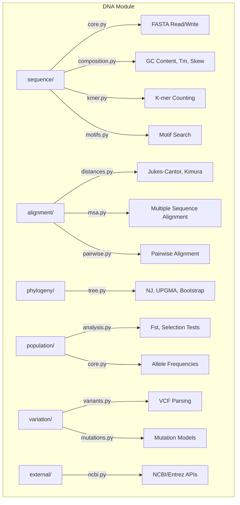

# DNA Module

DNA sequence analysis, phylogenetics, population genetics, and genomic data integration for METAINFORMANT.

## Architecture



## Submodules

| Module | Purpose |
|--------|---------|
| [`sequence/`](sequence/) | FASTA I/O (`read_fasta`, `write_fasta`), GC content, k-mers, motifs, restriction sites |
| [`alignment/`](alignment/) | Evolutionary distances (`jukes_cantor_distance`, `kimura_distance`), MSA, pairwise |
| [`phylogeny/`](phylogeny/) | Tree construction (`neighbor_joining_tree`, `upgma_tree`), `bootstrap_support`, Newick I/O |
| [`population/`](population/) | `calculate_fst`, selection tests, demographic inference, allele frequencies |
| [`variation/`](variation/) | VCF parsing, variant calling, mutation models |
| [`annotation/`](annotation/) | Gene prediction, functional annotation |
| [`expression/`](expression/) | Codon usage, transcription, translation |
| [`external/`](external/) | NCBI Entrez integration, genome downloads |
| [`integration/`](integration/) | Cross-module links to RNA expression data |
| [`io/`](io/) | FASTQ parsing and quality scores |

## Key Capabilities

### Sequence Analysis

```python
from metainformant.dna.sequence.core import read_fasta, write_fasta
from metainformant.dna.sequence.composition import gc_content, melting_temperature
from metainformant.dna.sequence.kmer import count_kmers

seqs = read_fasta("data/sequences.fasta")
gc = gc_content(seqs["gene1"])              # 0.0-1.0
tm = melting_temperature(seqs["gene1"])     # degrees C
kmers = count_kmers(seqs["gene1"], k=4)     # dict of 4-mer counts
```

### Phylogenetics

| Function | Description |
|----------|-------------|
| `neighbor_joining_tree` | Build NJ tree from distance matrix |
| `upgma_tree` | Build UPGMA tree from distance matrix |
| `nj_tree_from_kmer` | Build tree directly from k-mer distances |
| `bootstrap_support` | Compute bootstrap support values |
| `robinson_foulds_distance` | Compare tree topologies |
| `to_newick` / `from_newick` | Newick format I/O |

### Population Genetics

```python
from metainformant.dna.population.analysis import calculate_fst
from metainformant.dna.alignment.distances import jukes_cantor_distance, kimura_distance

fst = calculate_fst(pop1_sequences, pop2_sequences)
dist = jukes_cantor_distance("ATCGATCG", "ATCGATCC")
```

## Quick Start

```python
from metainformant.dna.sequence.core import read_fasta
from metainformant.dna.alignment.distances import jukes_cantor_distance
from metainformant.dna.phylogeny.tree import neighbor_joining_tree, to_newick

# Load sequences and build phylogeny
seqs = read_fasta("data/aligned.fasta")
tree = neighbor_joining_tree(seqs)
print(to_newick(tree))
```

## Related

- [metainformant.math.population_genetics](../math/population_genetics/) - Theoretical population genetics
- [metainformant.gwas](../gwas/) - Genome-wide association studies
- [metainformant.rna](../rna/) - RNA-seq expression analysis
- [docs/dna/](../../../docs/dna/) - DNA module documentation
