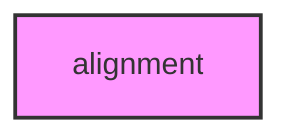

# ALIGNMENT

## Overview
Functionality for alignment.

## 📦 Contents
- `[distances.py](distances.py)`
- `[msa.py](msa.py)`
- `[pairwise.py](pairwise.py)`

## 📊 Structure



## Usage
Import module:
```python
from metainformant.metainformant.dna.alignment import ...
```
