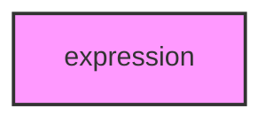

# EXPRESSION

## Overview
Functionality for expression.

## 📦 Contents
- `[codon.py](codon.py)`
- `[transcription.py](transcription.py)`
- `[translation.py](translation.py)`

## 📊 Structure



## Usage
Import module:
```python
from metainformant.metainformant.dna.expression import ...
```
