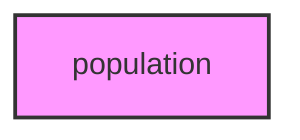

# POPULATION

## Overview
Functionality for population.

## 📦 Contents
- `[analysis.py](analysis.py)`
- `[core.py](core.py)`
- `[visualization.py](visualization.py)`

## 📊 Structure



## Usage
Import module:
```python
from metainformant.metainformant.dna.population import ...
```
