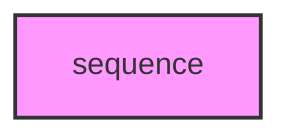

# SEQUENCE

## Overview
Functionality for sequence.

## 📦 Contents
- `[composition.py](composition.py)`
- `[consensus.py](consensus.py)`
- `[core.py](core.py)`
- `[motifs.py](motifs.py)`
- `[restriction.py](restriction.py)`

## 📊 Structure



## Usage
Import module:
```python
from metainformant.metainformant.dna.sequence import ...
```
