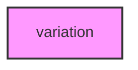

# VARIATION

## Overview
Functionality for variation.

## 📦 Contents
- `[mutations.py](mutations.py)`
- `[variants.py](variants.py)`

## 📊 Structure



## Usage
Import module:
```python
from metainformant.metainformant.dna.variation import ...
```
