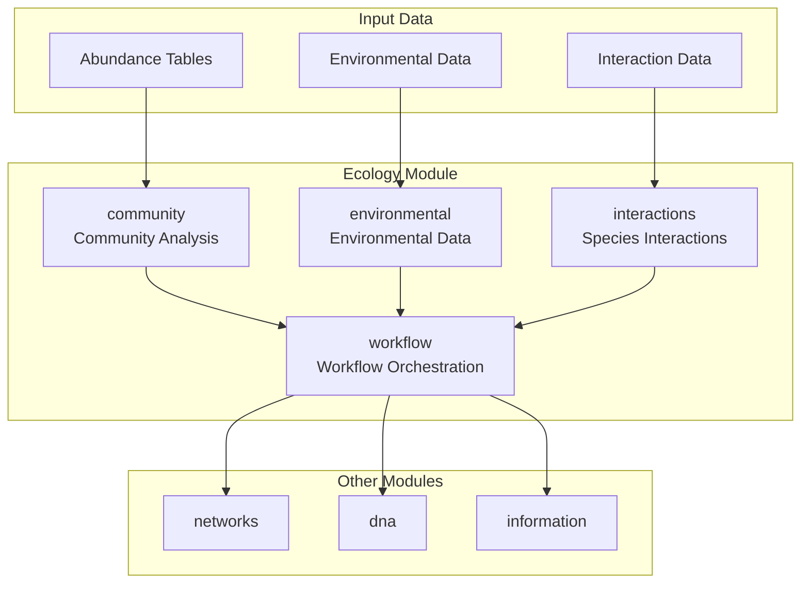
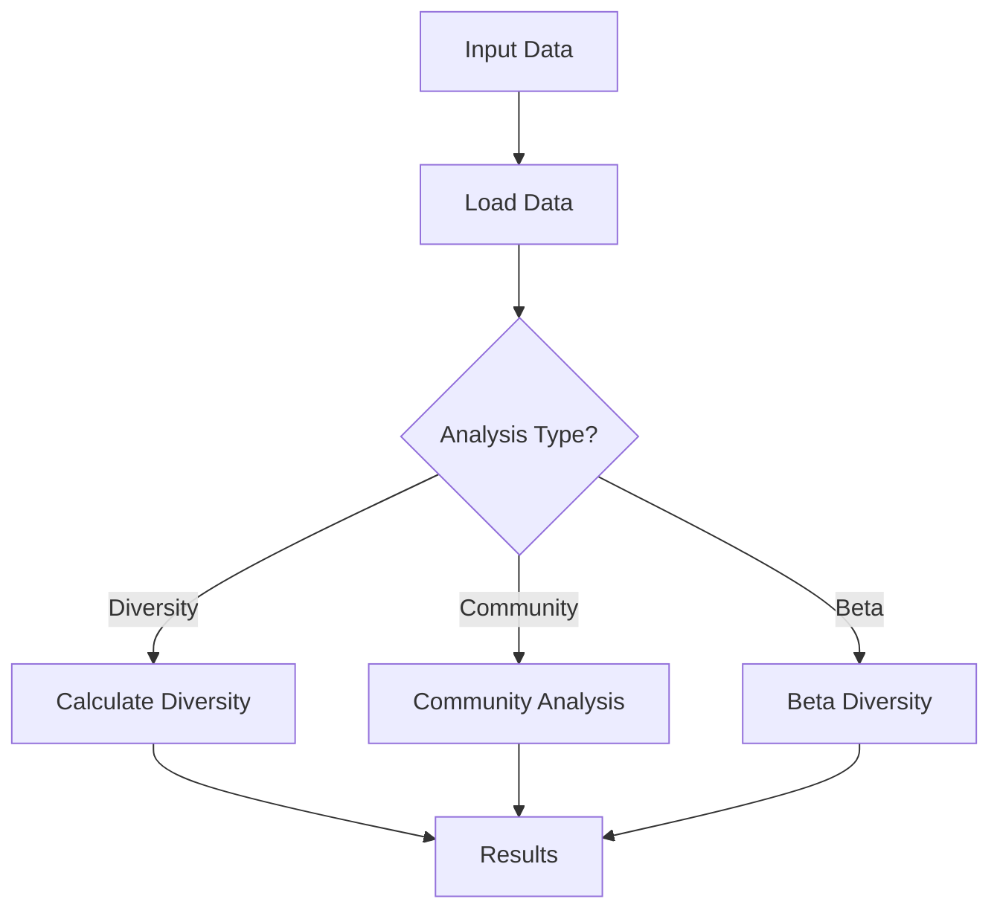

# Ecology Module

The `ecology` module provides tools for ecological metadata management, community analysis, and environmental data integration.

## Overview

This module handles ecological data including species diversity, community composition, and environmental parameters that influence biological systems.

### Module Architecture



### Ecology Analysis Workflow



## Submodules

### Community Analysis (`community.py`)
Tools for analyzing ecological communities and species interactions.

**Key Features:**
- Species diversity metrics (Shannon, Simpson indices)
- Community composition analysis
- Species abundance distributions
- Beta diversity calculations

**Usage:**
```python
from metainformant.ecology.community import (
    shannon_diversity,
    simpson_diversity,
    species_richness,
    pielou_evenness,
    chao1_estimator
)

# Community analysis
abundance_data = [10, 8, 6, 4, 2, 1]
diversity = shannon_diversity(abundance_data)
simpson = simpson_diversity(abundance_data)
richness = species_richness(abundance_data)
evenness = pielou_evenness(abundance_data)
richness_est = chao1_estimator([int(x) for x in abundance_data])
```

## Integration with Other Modules

### With DNA Module
```python
from metainformant.dna import population
from metainformant.ecology.community import shannon_diversity

# Ecological context for genetic diversity
genetic_diversity = population.nucleotide_diversity(sequences)
# Ecological diversity from species abundances
species_abundances = [10, 8, 6, 4, 2]
ecological_diversity = shannon_diversity(species_abundances)
```

### With Visualization Module
```python
from metainformant.ecology.community import shannon_diversity, simpson_diversity
from metainformant.visualization import lineplot, scatter_plot
import numpy as np

# Visualize diversity metrics across sites
sites = ["Site1", "Site2", "Site3", "Site4"]
abundance_matrices = [
    [10, 8, 6, 4, 2],
    [5, 7, 9, 3, 1],
    [12, 4, 8, 6, 3],
    [8, 6, 5, 4, 2]
]

# Calculate diversity for each site
shannon_values = [shannon_diversity(abund) for abund in abundance_matrices]
simpson_values = [simpson_diversity(abund) for abund in abundance_matrices]

# Visualize diversity patterns
ax = scatter_plot(shannon_values, simpson_values, 
                  xlabel="Shannon Diversity", ylabel="Simpson Diversity",
                  title="Diversity Metrics Across Sites")
```

### With Information Theory Module
```python
from metainformant.ecology.community import shannon_diversity
from metainformant.information import shannon_entropy

# Compare ecological diversity with information-theoretic entropy
species_abundances = [10, 8, 6, 4, 2, 1]

# Ecological diversity (normalized by total abundance)
eco_diversity = shannon_diversity(species_abundances)

# Information-theoretic entropy (from relative abundances)
total = sum(species_abundances)
proportions = [a / total for a in species_abundances]
info_entropy = shannon_entropy(proportions)

# Both metrics measure diversity/information content
```

## Data Sources

- Species occurrence databases
- Environmental monitoring data
- Biodiversity surveys and inventories
- Ecological metadata repositories

## Performance Features

- Efficient processing of large ecological datasets
- Memory-optimized community calculations
- Support for sparse ecological matrices

## Testing

Comprehensive tests cover:
- Diversity metric calculations
- Community analysis algorithms
- Integration with environmental data

## Dependencies

- NumPy for numerical computations
- Pandas for data manipulation
- Optional: specialized ecological packages

This module provides essential tools for ecological data analysis and biodiversity research.
