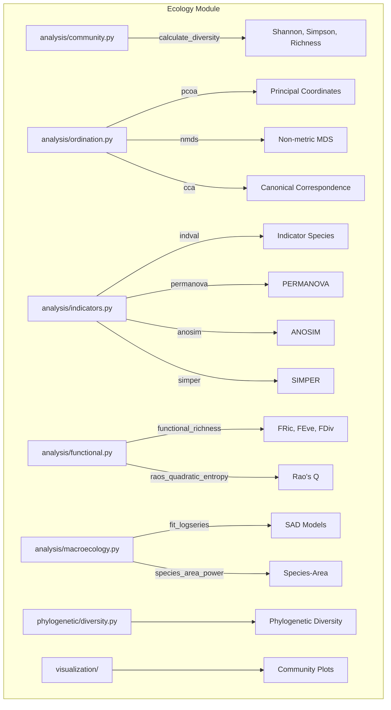

# Ecology Module

Community ecology analysis: diversity indices, ordination, species abundance distributions, and functional trait analysis.

## Architecture



## Key Capabilities

### Diversity Indices

```python
from metainformant.ecology.analysis.community import calculate_diversity

# Shannon diversity for multiple communities
shannon = calculate_diversity([[10, 20, 30, 40], [5, 5, 5, 85]], method="shannon")
simpson = calculate_diversity([[10, 20, 30, 40]], method="simpson")
```

### Ordination

| Function | Module | Description |
|----------|--------|-------------|
| `pcoa` | `analysis.ordination` | Principal Coordinates Analysis (Gower double-centering) |
| `nmds` | `analysis.ordination` | Non-metric MDS (Kruskal stress minimization) |
| `cca` | `analysis.ordination` | Canonical Correspondence Analysis |
| `distance_matrix` | `analysis.ordination` | Bray-Curtis, Jaccard, Euclidean, Canberra distances |
| `procrustes` | `analysis.ordination` | Procrustes rotation for ordination comparison |

### Hypothesis Testing and Indicators

| Function | Module | Description |
|----------|--------|-------------|
| `indval` | `analysis.indicators` | Indicator species analysis (Dufrene-Legendre) |
| `permanova` | `analysis.indicators` | Permutational MANOVA on distance matrices |
| `anosim` | `analysis.indicators` | Analysis of similarities |
| `simper` | `analysis.indicators` | Similarity percentages decomposition |
| `multivariate_dispersion` | `analysis.indicators` | Beta-dispersion (Anderson) |

### Functional Diversity

| Function | Module | Description |
|----------|--------|-------------|
| `functional_richness` | `analysis.functional` | FRic from convex hull volume |
| `functional_evenness` | `analysis.functional` | FEve from minimum spanning tree |
| `functional_divergence` | `analysis.functional` | FDiv weighted divergence |
| `raos_quadratic_entropy` | `analysis.functional` | Rao's quadratic entropy |
| `functional_diversity_suite` | `analysis.functional` | All indices in one call |

## Submodules

| Module | Purpose |
|--------|---------|
| [`analysis/`](analysis/) | Community diversity, ordination, indicators, functional traits, macroecology |
| [`phylogenetic/`](phylogenetic/) | Phylogenetic diversity metrics |
| [`visualization/`](visualization/) | Community ecology plots |

## Quick Start

```python
from metainformant.ecology.analysis.community import calculate_diversity
from metainformant.ecology.analysis.ordination import distance_matrix, pcoa
from metainformant.ecology.analysis.indicators import permanova
from metainformant.ecology.analysis.functional import functional_diversity_suite

# Compute Bray-Curtis distances between communities
abundances = [[10, 20, 0, 5], [12, 18, 3, 7], [0, 5, 30, 15]]
dist = distance_matrix(abundances, method="bray_curtis")

# PCoA ordination
coords = pcoa(dist, n_components=2)

# PERMANOVA test for group differences
result = permanova(dist, group_labels=["forest", "forest", "grassland"])

# Full functional diversity suite
fd = functional_diversity_suite(trait_matrix=traits, abundances=abund)
```

## Integration

- **DNA** -- Phylogenetic diversity metrics use tree structures from `metainformant.dna.phylogeny`
- **Information** -- Shannon entropy connects community diversity to information theory
- **Simulation** -- Agent-based ecological models via `metainformant.simulation`

## Related

- [`metainformant.information`](../information/) -- Information-theoretic foundations
- [`metainformant.dna.phylogeny`](../dna/phylogeny/) -- Phylogenetic tree construction
- [`metainformant.simulation`](../simulation/) -- Ecological simulation models
- [`docs/ecology/`](../../../docs/ecology/) -- Ecology analysis documentation
