# Ecology Module

The `ecology` module provides tools for ecological metadata management, community analysis, and environmental data integration.

## Overview

This module handles ecological data including species diversity, community composition, and environmental parameters that influence biological systems.

### Module Architecture


### Community Diversity Analysis


### Beta Diversity and Community Comparison


### Species-Environment Relationships

```mermaid
graph TD
    A[Species Data] --> B[Environmental Data]
    B --> C[Variable Selection]

    A --> D[Community Matrix]
    D --> E[Transformation]

    C --> F[Collinearity Check]
    F --> G[Variable Reduction]

    E --> H[Statistical Modeling]
    G --> H

    H --> I{Method}
    I -->|CCA| J[Canonical Correlation]
    I -->|RDA| K[Redundancy Analysis]
    I -->|PLS| L[Partial Least Squares]
    I -->|GLM| M[Generalized Linear Models]

    J --> N[Environment-Community Relations]
    K --> N
    L --> N
    M --> N

    N --> O[Significance Testing]
    O --> P[Permutation Tests]
    O --> Q[ANOVA]

    P --> R[Significant Relationships]
    Q --> R

    R --> S[Variable Importance]
    S --> T[Key Environmental Drivers]

    T --> U[Management Implications]

    style A fill:#e1f5fe,stroke:#01579b,stroke-width:2px
    style H fill:#fff3e0,stroke:#e65100,stroke-width:2px
    style U fill:#e8f5e8,stroke:#1b5e20,stroke-width:2px

    subgraph "Environmental Variables"
        V[Climate] -.-> B
        W[Soil] -.-> B
        X[Topography] -.-> B
        Y[Disturbance] -.-> B
    end

    subgraph "Data Transformations"
        Z[Hellinger] -.-> E
        AA[Chord] -.-> E
        BB[Log] -.-> E
    end

    subgraph "Model Evaluation"
        CC[R²] -.-> O
        DD[AIC] -.-> O
        EE[BIC] -.-> O
    end
```



### Ecological Network Analysis


### Temporal Community Dynamics


### Biodiversity Assessment Framework


## Submodules

### Community Analysis (`community.py`)
Tools for analyzing ecological communities and species interactions.

**Key Features:**
- Species diversity metrics (Shannon, Simpson indices)
- Community composition analysis
- Species abundance distributions
- Beta diversity calculations

**Usage:**
```python
from metainformant.ecology.community import (
    shannon_diversity,
    simpson_diversity,
    species_richness,
    pielou_evenness,
    chao1_estimator
)

# Community analysis
abundance_data = [10, 8, 6, 4, 2, 1]
diversity = shannon_diversity(abundance_data)
simpson = simpson_diversity(abundance_data)
richness = species_richness(abundance_data)
evenness = pielou_evenness(abundance_data)
richness_est = chao1_estimator([int(x) for x in abundance_data])
```

## Integration with Other Modules

### With DNA Module
```python
from metainformant.dna import population
from metainformant.ecology.community import shannon_diversity

# Ecological context for genetic diversity
genetic_diversity = population.nucleotide_diversity(sequences)
# Ecological diversity from species abundances
species_abundances = [10, 8, 6, 4, 2]
ecological_diversity = shannon_diversity(species_abundances)
```

### With Visualization Module
```python
from metainformant.ecology.community import shannon_diversity, simpson_diversity
from metainformant.visualization import lineplot, scatter_plot
import numpy as np

# Visualize diversity metrics across sites
sites = ["Site1", "Site2", "Site3", "Site4"]
abundance_matrices = [
    [10, 8, 6, 4, 2],
    [5, 7, 9, 3, 1],
    [12, 4, 8, 6, 3],
    [8, 6, 5, 4, 2]
]

# Calculate diversity for each site
shannon_values = [shannon_diversity(abund) for abund in abundance_matrices]
simpson_values = [simpson_diversity(abund) for abund in abundance_matrices]

# Visualize diversity patterns
ax = scatter_plot(shannon_values, simpson_values, 
                  xlabel="Shannon Diversity", ylabel="Simpson Diversity",
                  title="Diversity Metrics Across Sites")
```

### With Information Theory Module
```python
from metainformant.ecology.community import shannon_diversity
from metainformant.information import shannon_entropy

# Compare ecological diversity with information-theoretic entropy
species_abundances = [10, 8, 6, 4, 2, 1]

# Ecological diversity (normalized by total abundance)
eco_diversity = shannon_diversity(species_abundances)

# Information-theoretic entropy (from relative abundances)
total = sum(species_abundances)
proportions = [a / total for a in species_abundances]
info_entropy = shannon_entropy(proportions)

# Both metrics measure diversity/information content
```

## Data Sources

- Species occurrence databases
- Environmental monitoring data
- Biodiversity surveys and inventories
- Ecological metadata repositories

## Performance Features

- Efficient processing of large ecological datasets
- Memory-optimized community calculations
- Support for sparse ecological matrices

## Testing

Comprehensive tests cover:
- Diversity metric calculations
- Community analysis algorithms
- Integration with environmental data

## Dependencies

- NumPy for numerical computations
- Pandas for data manipulation
- Optional: specialized ecological packages

## See Also

- **[AGENTS.md](AGENTS.md)**: AI agent contributions and development details for the ecology module

## Related Modules

The Ecology module integrates with several other METAINFORMANT modules:

- **Networks Module**: Ecological interaction networks, food web analysis, and community structure modeling
- **DNA Module**: DNA barcoding for species identification; biodiversity assessment using sequence data
- **Information Module**: Information-theoretic analysis of ecological complexity and biodiversity patterns
- **Multi-omics Module**: Ecological multi-omics data integration; environmental metagenomics
- **Visualization Module**: Ecological data visualization, diversity plots, and community structure diagrams
- **ML Module**: Machine learning analysis of ecological data; species distribution modeling
- **Quality Module**: Ecological data validation and quality control; biodiversity assessment standards
- **Simulation Module**: Ecosystem simulation and modeling; virtual ecological experiments
- **Math Module**: Mathematical modeling of population dynamics and ecological processes
- **Phenotype Module**: Ecological trait analysis and morphological biodiversity studies

This module provides essential tools for ecological data analysis and biodiversity research.
