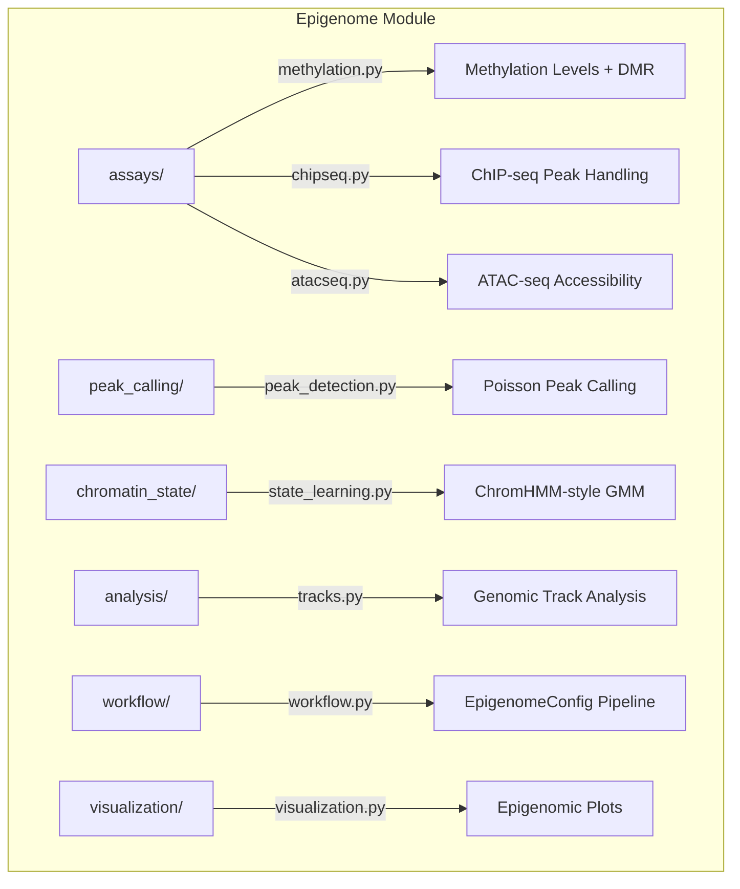

# Epigenome Module

DNA methylation, ChIP-seq, ATAC-seq analysis and chromatin state discovery for METAINFORMANT.

## Architecture



## Submodules

| Module | Purpose |
|--------|---------|
| [`assays/`](assays/) | `MethylationSite`, `ChIPPeak`, `ATACPeak` data classes and loaders |
| [`peak_calling/`](peak_calling/) | Signal-based peak detection with Poisson statistics, summit refinement |
| [`chromatin_state/`](chromatin_state/) | ChromHMM-style state learning via GMM + Viterbi assignment |
| [`analysis/`](analysis/) | Genomic track analysis, signal processing |
| [`workflow/`](workflow/) | `EpigenomeConfig` for integrated methylation + ChIP + ATAC pipelines |
| [`visualization/`](visualization/) | Heatmaps, genome browser tracks, methylation plots |

## Key Capabilities

### Methylation Analysis

```python
from metainformant.epigenome.assays.methylation import MethylationSite, load_methylation_bedgraph

sites = load_methylation_bedgraph("data/methylation.bedgraph", min_coverage=5)
for chrom, site_list in sites.items():
    for site in site_list:
        print(f"{site.chromosome}:{site.position} beta={site.methylation_level:.2f}")
```

### ChIP-seq and ATAC-seq

| Class / Function | Description |
|------------------|-------------|
| `ChIPPeak` | ChIP-seq peak with score, p-value, q-value, summit |
| `ATACPeak` | ATAC-seq accessible region with signal and significance |
| `MethylationSite` | CpG site with methylated/total reads and beta value |
| `load_methylation_bedgraph` | Parse BEDgraph methylation files |

```python
from metainformant.epigenome.assays.chipseq import ChIPPeak
from metainformant.epigenome.assays.atacseq import ATACPeak

peak = ChIPPeak(chromosome="chr1", start=1000, end=2000, summit=1500, q_value=0.01)
print(f"Peak length: {peak.length} bp, center: {peak.center}")
```

### Chromatin State and Workflow

```python
from metainformant.epigenome.chromatin_state.state_learning import learn_chromatin_states
from metainformant.epigenome.workflow.workflow import EpigenomeConfig

# GMM-based state learning from histone mark signals
states = learn_chromatin_states(signal_matrix, n_states=15, mark_names=["H3K4me3", "H3K27ac"])

# Configure integrated pipeline
config = EpigenomeConfig(
    input_dir="data/epigenome",
    output_dir="output/epigenome",
    run_methylation=True,
    run_chipseq=True,
    integrate_results=True,
)
```

## Quick Start

```python
from metainformant.epigenome.assays.methylation import MethylationSite
from metainformant.epigenome.assays.chipseq import ChIPPeak

# Create and inspect epigenomic features
site = MethylationSite("chr1", 10000, methylated_reads=8, total_reads=10)
print(f"Beta value: {site.methylation_level}")  # 0.8

peak = ChIPPeak("chr1", start=9500, end=10500, summit=10000, score=150.0)
print(f"H3K4me3 peak: {peak.length} bp")  # 1000
```

## Related

- [metainformant.dna](../dna/) - DNA sequence and variant analysis
- [metainformant.singlecell](../singlecell/) - Single-cell epigenomics integration
- [metainformant.visualization](../visualization/) - General plotting utilities
- [docs/epigenome/](../../../docs/epigenome/) - Epigenome module documentation
