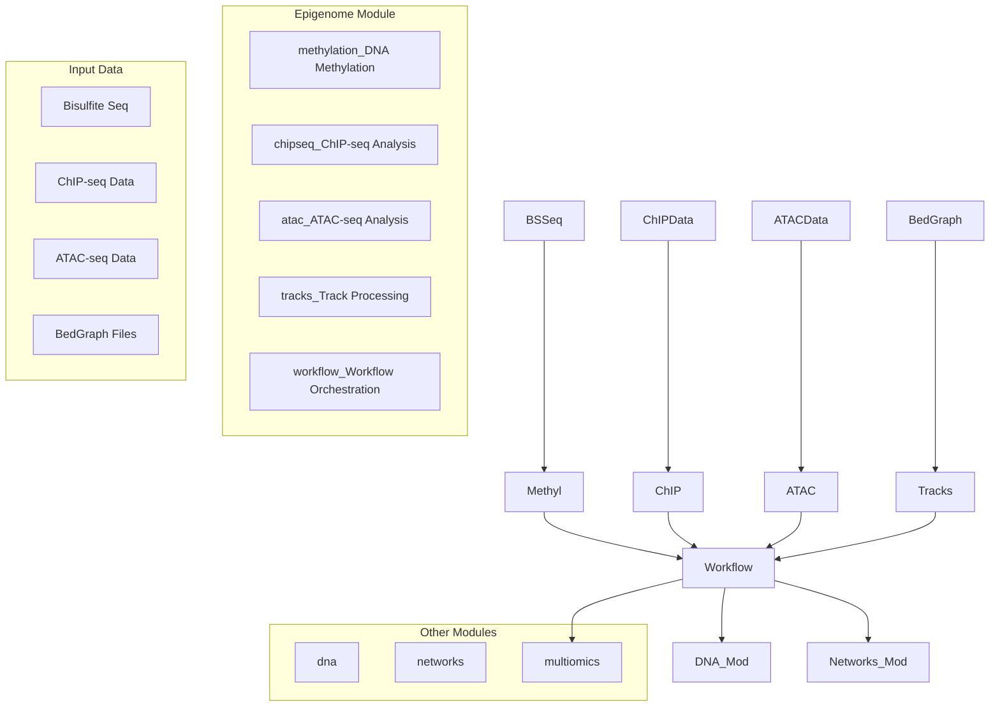
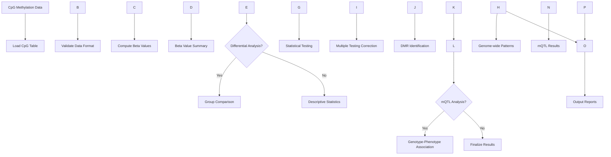
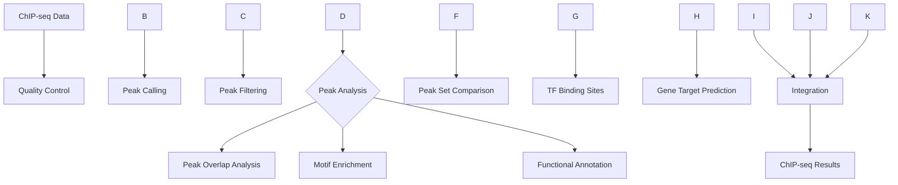

# Epigenome Module

The `epigenome` module provides tools for epigenetic modification analysis, including DNA methylation, chromatin structure, and histone modifications.

## Overview

This module handles epigenetic data processing, from raw sequencing data to biological interpretation of epigenetic modifications.

### Module Architecture



### Epigenome Analysis Workflow

```mermaid
graph TD
    ArawEpigenomicData[Raw Epigenomic Data] --> B{Data Type}
    B -->|Bisulfite-seq| CmethylationAnalysis[Methylation Analysis]
    B -->|ChIP-seq| Dchip-seqAnalysis[ChIP-seq Analysis]
    B -->|ATAC-seq| Eatac-seqAnalysis[ATAC-seq Analysis]
    B -->|BedGraph| FtrackProcessing[Track Processing]

    C --> GloadCpgData[Load CpG Data]
    G --> HcomputeBetaValues[Compute Beta Values]
    H --> IdifferentialMethylation[Differential Methylation]
    I --> JmqtlAnalysis[mQTL Analysis]

    D --> KpeakCalling[Peak Calling]
    K --> LpeakAnalysis[Peak Analysis]
    L --> MmotifEnrichment[Motif Enrichment]

    E --> NopenChromatinAnalysis[Open Chromatin Analysis]
    N --> Otn5IntegrationSites[Tn5 Integration Sites]
    O --> PaccessibilityAnalysis[Accessibility Analysis]

    F --> QtrackLoading[Track Loading]
    Q --> RgenomeBrowserTracks[Genome Browser Tracks]

    J --> S[Integration]
    M --> S
    P --> S
    R --> S

    S --> Tmulti-omicsIntegration[Multi-Omics Integration]
    T --> UoutputResults[Output Results]


    subgraph "Quality Control"
        VdataValidation[Data Validation] -.-> C
        V -.-> D
        V -.-> E
        V -.-> F
    end

    subgraph "Statistical Analysis"
        WdifferentialAnalysis[Differential Analysis] -.-> I
        XenrichmentAnalysis[Enrichment Analysis] -.-> M
        YpeakOverlap[Peak Overlap] -.-> L
    end
```



### Methylation Analysis Pipeline



### ChIP-seq Analysis Pipeline



## Submodules

### Methylation Analysis (`methylation.py`)
DNA methylation pattern detection and analysis.

**Key Features:**
- Methylation calling from sequencing data
- Differential methylation analysis
- Methylation quantitative trait locus (mQTL) mapping
- Methylation age prediction

**Usage:**
```python
from metainformant.epigenome import load_cpg_table, compute_beta_values, summarize_beta_by_chromosome

# Load methylation data from CPG table
cpg_df = load_cpg_table("methylation_data.tsv")

# Compute beta values (methylation levels)
cpg_df = compute_beta_values(cpg_df)

# Summarize by chromosome
summary = summarize_beta_by_chromosome(cpg_df)
```

### Chromatin Tracks (`tracks.py`)
Chromatin state and accessibility analysis.

**Key Features:**
- ATAC-seq and DNase-seq processing
- Chromatin accessibility quantification
- Peak calling and annotation
- Chromatin state segmentation

**Usage:**
```python
from metainformant.epigenome import read_bedgraph

# Load chromatin track data
bedgraph_df = read_bedgraph("chromatin_track.bedgraph")
# DataFrame columns: chromosome, start, end, value
```

## Integration with Other Modules

### With DNA Module
```python
from metainformant.dna import sequences
from metainformant.epigenome import load_cpg_table, compute_beta_values

# Epigenetic regulation of DNA sequences

# Load DNA sequences
seqs = sequences.read_fasta("sequences.fasta")

# Load and analyze methylation
cpg_df = load_cpg_table("methylation.tsv")
methylation = compute_beta_values(cpg_df)
# Analyze promoter methylation using genomic coordinates
```

### With Visualization Module
```python
from metainformant.epigenome import summarize_beta_by_chromosome
from metainformant.visualization import lineplot

# Visualize methylation patterns

# Summarize methylation by chromosome
summary = summarize_beta_by_chromosome(methylation_df)

# Visualize methylation levels
# Use chromosome/position data from summary for plotting
ax = lineplot(None, summary["mean_beta"].values)
ax.set_title("DNA Methylation Profile")
```

## Data Formats

- **Bisulfite sequencing**: Bismark, BS-Seeker output formats
- **ATAC-seq**: BED, narrowPeak, broadPeak formats
- **ChIP-seq**: BED, SAM, BAM formats
- **WGBS**: Methylation call formats

## Performance Features

- Memory-efficient processing of large epigenomic datasets
- Parallel peak calling and analysis
- Streaming processing for genome-scale data

## Testing

Comprehensive tests cover:
- Methylation calling accuracy
- Peak detection algorithms
- Integration with genomic annotations

## Dependencies

- PyBedTools for genomic interval operations
- Optional: specialized epigenomic analysis packages

## See Also

- **[AGENTS.md](AGENTS.md)**: AI agent contributions and development details for the epigenome module

## Related Modules

The Epigenome module integrates with several other METAINFORMANT modules:

- **DNA Module**: Epigenetic modifications mapped to genomic DNA sequences; CpG island identification and methylation pattern analysis
- **Networks Module**: Chromatin interaction networks, enhancer-promoter regulatory networks, and epigenetic regulation modeling
- **Multi-omics Module**: Epigenetic data integration with DNA, RNA, and protein data; regulatory analysis
- **RNA Module**: Gene expression regulation by epigenetic modifications; transcription factor binding analysis
- **Protein Module**: Histone modifications and chromatin-associated protein analysis
- **Quality Module**: Epigenetic data quality assessment and preprocessing
- **Visualization Module**: Genome browser tracks, epigenetic modification heatmaps, and chromatin state visualization
- **ML Module**: Machine learning analysis of epigenetic patterns and regulatory predictions
- **Information Module**: Information-theoretic analysis of epigenetic complexity and regulatory patterns
- **GWAS Module**: Epigenetic modifications as quantitative traits; methylation quantitative trait loci (mQTL) analysis

This module provides essential tools for epigenetic research and chromatin biology.
