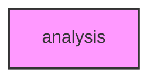

# ANALYSIS

## Overview
Functionality for analysis.

## 📦 Contents
- `[__init__.py](__init__.py)`
- `[tracks.py](tracks.py)`

## 📊 Structure



## Usage
Import module:
```python
from metainformant.metainformant.epigenome.analysis import ...
```
