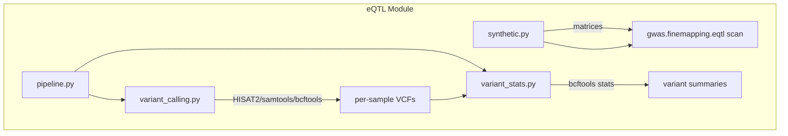

# eQTL Module

eQTL and transcriptome-variant analysis: synthetic/real input-data construction, HISAT2+bcftools variant-calling wrappers, bcftools stats parsing, and full pipeline orchestration.

## Overview

The `eqtl` module holds the reusable methods behind the eQTL integration
pipeline (GWAS variants x Amalgkit RNA-seq expression). Scripts under
`scripts/eqtl/` are thin orchestrators that import from here.

## Table of Contents

- [Architecture](#architecture)
- [Submodules](#submodules)
- [Quick Start](#quick-start)
- [Related](#related)

## Architecture



## Submodules

| Module | Purpose |
|--------|---------|
| [`synthetic.py`](synthetic.py) | Synthetic expression/genotype generators, kallisto target-ID position parsing, real quantification loader |
| [`variant_calling.py`](variant_calling.py) | Tool checks, FASTQ acquisition, HISAT2 index/alignment, bcftools call/filter/merge |
| [`variant_stats.py`](variant_stats.py) | bcftools stats parsing, per-sample and population summaries, allele-frequency extraction |
| [`pipeline.py`](pipeline.py) | Parameter resolution and end-to-end run orchestration |

## Quick Start

```python
from metainformant.eqtl import create_synthetic_data
from metainformant.gwas.finemapping.eqtl import cis_eqtl_scan

expr, geno, gene_pos, var_pos = create_synthetic_data(n_genes=20, n_variants=100, n_samples=30)
results = cis_eqtl_scan(expr, geno, gene_pos, var_pos, cis_window=1_000_000)
```

```bash
# Full pipeline (requires hisat2, samtools, bcftools, curl and AMALGKIT_DATA_ROOT)
uv run python scripts/eqtl/rna_snp_pipeline.py --species amellifera --n-samples 3

# Demo with synthetic data
uv run python scripts/eqtl/run_eqtl_demo.py
```

## Tests

Zero-mocks tests: `tests/eqtl/` (synthetic frames, real bcftools parsing on
fixture text, subprocess-free where tools are unavailable).

## Related

- [eQTL Scripts](../../../scripts/eqtl/) - thin orchestrators
- [GWAS Fine-Mapping](../gwas/finemapping/) - cis/trans scans, effect sizes
- [RNA Core](../rna/) - sample_utils, ENA downloader
