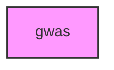

# GWAS

## Overview
Genome-Wide Association Studies (GWAS) module for METAINFORMANT.

## 📦 Contents
- **[analysis/](analysis/)**
- **[data/](data/)**
- **[visualization/](visualization/)**
- **[workflow/](workflow/)**
- `[__init__.py](__init__.py)`

## 📊 Structure



## Usage
Import module:
```python
from metainformant.metainformant.gwas import ...
```
