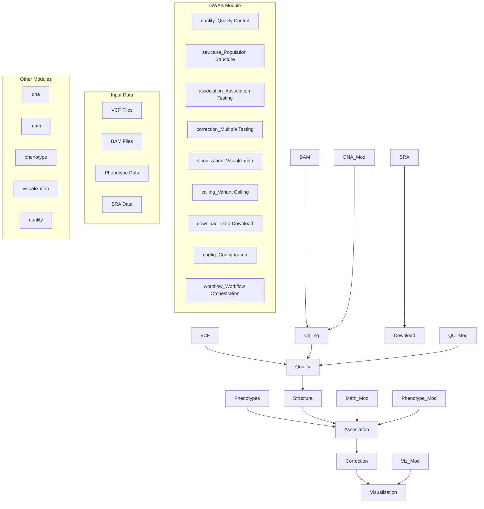
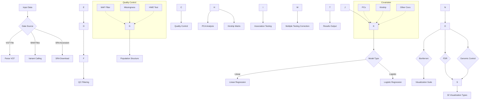
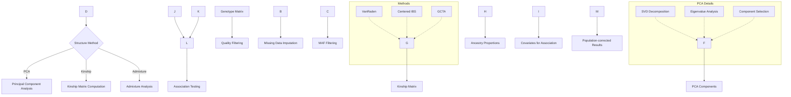
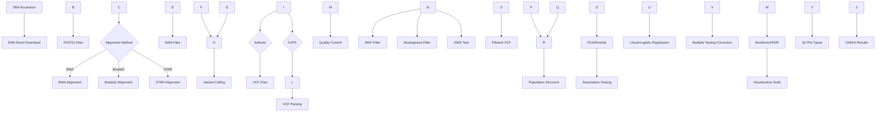

# GWAS Module

Genome-Wide Association Studies (GWAS) module for identifying genetic variants associated with phenotypic traits.

## Overview

This module provides GWAS functionality integrated with METAINFORMANT's bioinformatics ecosystem.

### Module Architecture



### Complete GWAS Pipeline



### 32 GWAS Visualization Types

```mermaid
graph TD
    AgwasResults[GWAS Results] --> B{Population Structure}
    A --> C{Variant Effects}
    A --> D{Genome-wide Views}
    A --> E{Regional Analysis}
    A --> F{Statistical Validation}
    A --> G{Comparison Views}
    A --> H{Variant-level Analysis}

    B --> IpcaPlot[PCA Plot]
    B --> JkinshipHeatmap[Kinship Heatmap]
    B --> KpopulationAdmixture[Population Admixture]
    B --> LstructurePlot[Structure Plot]

    C --> MeffectSizeDistribution[Effect Size Distribution]
    C --> NoddsRatioPlot[Odds Ratio Plot]
    C --> OalleleFrequencyVsEffect[Allele Frequency vs Effect]
    C --> PbetaCoefficientPlot[Beta Coefficient Plot]

    D --> QmanhattanPlot[Manhattan Plot]
    D --> RqqPlot[QQ Plot]
    D --> Sgenome-wideSignificance[Genome-wide Significance]
    D --> Tp-valueHistogram[P-value Histogram]

    E --> UregionalManhattan[Regional Manhattan]
    E --> VregionalAssociation[Regional Association]
    E --> WlinkageDisequilibrium[Linkage Disequilibrium]
    E --> XrecombinationRate[Recombination Rate]

    F --> YgenomicInflationFactor[Genomic Inflation Factor]
    F --> ZlambdaGcPlot[Lambda GC Plot]
    F --> AAp-valueDistribution[P-value Distribution]
    F --> BBpowerAnalysis[Power Analysis]

    G --> CCmeta-analysisPlot[Meta-analysis Plot]
    G --> DDcross-studyComparison[Cross-study Comparison]
    G --> EEcohortEffectSizes[Cohort Effect Sizes]
    G --> FFreplicationAnalysis[Replication Analysis]

    H --> GGvariantAnnotation[Variant Annotation]
    H --> HHfunctionalImpact[Functional Impact]
    H --> IIconservationScores[Conservation Scores]
    H --> JJexpressionQtl[Expression QTL]

    I --> KKoutputSuite[Output Suite]
    J --> KK
    K --> KK
    L --> KK
    M --> KK
    N --> KK
    O --> KK
    P --> KK
    Q --> KK
    R --> KK
    S --> KK
    T --> KK
    U --> KK
    V --> KK
    W --> KK
    X --> KK
    Y --> KK
    Z --> KK
    AA --> KK
    BB --> KK
    CC --> KK
    DD --> KK
    EE --> KK
    FF --> KK
    GG --> KK
    HH --> KK
    II --> KK
    JJ --> KK

```



### Population Structure Analysis



### SRA Download to GWAS Pipeline


    Calling --> Load
    Load --> QC[Quality Control]
    QC --> Filter[Filter Variants]
    Filter --> Structure[Population Structure]
    Structure --> Assoc[Association Testing]
    Assoc --> Correct[Multiple Testing Correction]
    Correct --> Viz[Visualization]
    Viz --> Results[Results]
```

## Components

- **quality.py** - Quality control filters (MAF, missingness, HWE, quality scores)
- **structure.py** - Population structure analysis (PCA, kinship matrices)
- **association.py** - Association testing (linear/logistic regression)
- **correction.py** - Multiple testing correction (Bonferroni, FDR, genomic control)
- **visualization.py** - Comprehensive GWAS visualization suite (population structure, effects, comparisons, reports)
- **calling.py** - Variant calling integration (bcftools, GATK) ✅ Integrated into workflow
- **download.py** - Data acquisition (reference genomes ✅, variant databases ⚠️ partial implementation)
- **config.py** - Configuration management and validation
- **workflow.py** - Complete workflow orchestration

## Quick Start

```python
from metainformant.gwas import load_gwas_config, execute_gwas_workflow

# Load and execute workflow
config = load_gwas_config("config/gwas/gwas_template.yaml")
results = execute_gwas_workflow(config)
```

## CLI Usage

```bash
python -m metainformant gwas run --config config/gwas/gwas_template.yaml
```

## Documentation

Complete documentation available in [`docs/gwas/`](../../../docs/gwas/):
- [Overview](../../../docs/gwas/index.md)
- [Workflow Guide](../../../docs/gwas/workflow.md)
- [Configuration Reference](../../../docs/gwas/config.md)

## Integration with Other Modules

### With DNA Variants Module
```python
from metainformant.dna import variants
from metainformant.gwas import parse_vcf_full, apply_qc_filters

# VCF parsing and analysis workflow
# Parse VCF file containing variant data
vcf_data = parse_vcf_full("variants.vcf")

# Use DNA module for additional variant operations
vcf_info = variants.parse_vcf("variants.vcf")

# Apply quality control filters and write filtered VCF
qc_results = apply_qc_filters(
    vcf_path="variants.vcf",
    config={
        "min_maf": 0.05,
        "max_missing": 0.1,
        "hwe_pval": 1e-6,
        "min_qual": 30.0,
        "exclude_indels": True
    },
    output_vcf="output/filtered_variants.vcf.gz"  # Write filtered VCF
)
print(f"Variants before: {qc_results['num_variants_before']}")
print(f"Variants after: {qc_results['num_variants_after']}")

# Extract variant information for association testing
genotype_matrix = extract_genotypes(qc_variants)
variant_positions = extract_positions(qc_variants)
```

### With DNA Population Module
```python
from metainformant.dna import population
from metainformant.gwas import compute_pca, compute_kinship

# Population genetics integration
# Load sequences for population analysis
sequences = population.read_sequences("populations.fasta")

# Calculate population diversity metrics
nuc_diversity = population.nucleotide_diversity(sequences)
tajima_d = population.tajimas_D(sequences)

# Use population structure for GWAS
# PCA for population stratification
pca_result = compute_pca(genotype_matrix, n_components=10)
pca_covariates = pca_result["components"]

# Kinship matrix for relatedness correction
kinship_matrix = compute_kinship(genotype_matrix)

# Include population genetics metrics in association testing
association_results = association_test_linear(
    genotype_matrix,
    phenotypes,
    covariates=pca_covariates,  # Population structure covariates
    kinship=kinship_matrix  # Relatedness matrix
)
```

### With Math Popgen Module
```python
from metainformant.math import popgen_stats
from metainformant.gwas import association_test_linear

# Theoretical population genetics calculations
# Calculate expected allele frequencies
allele_freqs = calculate_allele_frequencies(genotype_matrix)

# Use theoretical models for interpretation
# Expected heterozygosity
expected_het = popgen_stats.expected_heterozygosity(allele_freqs)

# Hardy-Weinberg equilibrium
hwe_pvalues = popgen_stats.hardy_weinberg_test(genotype_matrix)

# Fst between populations
fst_values = popgen_stats.fst_calculation(pop1_genotypes, pop2_genotypes)

# Use theoretical expectations for filtering
# Filter variants deviating from HWE
hwe_filtered = genotype_matrix[hwe_pvalues > 1e-6]

# Association testing with theoretical context
association_results = association_test_linear(
    hwe_filtered,
    phenotypes,
    covariates=None
)
```

### With ML Regression Module
```python
from metainformant.ml import BiologicalRegressor, cross_validate_biological
from metainformant.gwas import association_test_linear, association_test_logistic

# Association testing using ML regression models
# Linear regression for continuous traits
linear_results = association_test_linear(
    genotype_matrix,
    phenotypes,
    covariates=covariates
)

# Logistic regression for binary traits
logistic_results = association_test_logistic(
    genotype_matrix,
    binary_phenotypes,
    covariates=covariates
)

# Use ML module for regression
regressor = BiologicalRegressor(algorithm="lasso", alpha=0.01, random_state=42)
# Fit regressor for each variant
for variant_idx in range(genotype_matrix.shape[1]):
    variant_genotypes = genotype_matrix[:, variant_idx]
    regressor.fit(variant_genotypes.reshape(-1, 1), phenotypes)
    predictions = regressor.predict(variant_genotypes.reshape(-1, 1))

# Cross-validation for model assessment
cv_results = cross_validate_biological(
    regressor,
    genotype_matrix[:, 0:1],  # Single variant
    phenotypes,
    cv=5
)
```

### GWAS Visualization Suite
```python
from metainformant.gwas import visualization as gwas_viz

# Population structure visualization
pca_result = gwas_viz.compute_pca(genotype_matrix, n_components=10)
gwas_viz.pca_plot(pca_result, output_path="output/gwas/pca_plot.png")
gwas_viz.pca_scree_plot(pca_result, output_path="output/gwas/pca_scree.png")

# Kinship and admixture analysis
kinship_matrix = gwas_viz.compute_kinship_matrix(genotype_matrix)
gwas_viz.kinship_heatmap(kinship_matrix, output_path="output/gwas/kinship.png")
gwas_viz.admixture_plot(admixture_results, output_path="output/gwas/admixture.png")
gwas_viz.population_tree(kinship_matrix, output_path="output/gwas/tree.png")

# Variant analysis plots
gwas_viz.allele_frequency_spectrum(vcf_data, output_path="output/gwas/afs.png")
gwas_viz.effect_size_distribution(association_results, output_path="output/gwas/effect_dist.png")

# Effect visualization
gwas_viz.effect_size_plot(association_results, output_path="output/gwas/effects.png")
gwas_viz.odds_ratio_plot(association_results, output_path="output/gwas/odds_ratios.png")
gwas_viz.qq_plot(association_results, output_path="output/gwas/qq_plot.png")

# Comparative analysis
gwas_viz.study_comparison_plot([study1_results, study2_results], output_path="output/gwas/comparison.png")
gwas_viz.meta_analysis_plot(meta_results, output_path="output/gwas/meta.png")

# Complete GWAS report generation
gwas_viz.generate_gwas_report(
    association_results=association_results,
    pca_results=pca_result,
    kinship_matrix=kinship_matrix,
    output_dir="output/gwas/report/",
    significance_threshold=5e-8
)

# All-in-one visualization suite
gwas_viz.plot_gwas_suite(
    association_results=association_results,
    pca_results=pca_result,
    kinship_matrix=kinship_matrix,
    output_dir="output/gwas/complete/",
    significance_threshold=5e-8
)
```

### With Quality Module
```python
from metainformant.gwas import apply_qc_filters, parse_vcf_full
from metainformant.quality import analyze_fastq_quality
from metainformant.dna.fastq import iter_fastq

# Comprehensive QC workflow for GWAS
# Quality assessment before variant calling
genomic_reads = list(iter_fastq("genomic_reads.fastq"))
quality_stats = analyze_fastq_quality(genomic_reads)

# Parse VCF after variant calling
vcf_data = parse_vcf_full("variants.vcf")

# Apply GWAS-specific QC filters
qc_variants = apply_qc_filters(
    vcf_data,
    maf_threshold=0.05,  # Minor allele frequency
    missing_threshold=0.1,  # Missing data threshold
    hwe_threshold=1e-6  # Hardy-Weinberg equilibrium
)

# Generate QC report
qc_report = {
    "initial_variants": len(vcf_data),
    "after_maf_filter": len(qc_variants[qc_variants["maf"] >= 0.05]),
    "after_missing_filter": len(qc_variants[qc_variants["missing_rate"] <= 0.1]),
    "after_hwe_filter": len(qc_variants[qc_variants["hwe_pvalue"] > 1e-6])
}

# Use quality-filtered variants for association testing
genotype_matrix = extract_genotypes(qc_variants)
association_results = association_test_linear(
    genotype_matrix,
    phenotypes,
    covariates=covariates
)
```

## Scientific Methods

Based on established GWAS methods:
- Price et al. (2006) - PCA for population stratification
- VanRaden (2008) - Kinship matrix computation
- Benjamini & Hochberg (1995) - FDR correction
- Yang et al. (2011) - GCTA methods

## Related Modules

- **DNA**: Variant parsing and population genetics
- **Math**: Theoretical population genetics
- **ML**: Regression and classification models
- **Visualization**: Manhattan and Q-Q plots

