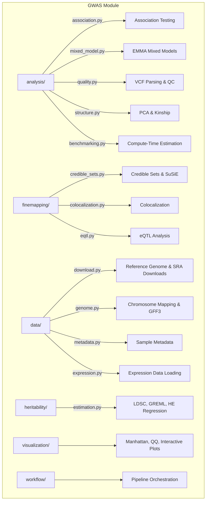

# GWAS Module

Genome-Wide Association Studies analysis, fine-mapping, variant-expression integration, and compute-time benchmarking.

## 📊 Architecture


```mermaid
graph TD
    subgraph "GWAS Module"
        A[analysis/] --> |association.py| AS[Association Testing]
        A --> |mixed_model.py| LM[EMMA Mixed Models]
        A --> |quality.py| QC[VCF Parsing & QC]
        A --> |structure.py| ST[PCA & Kinship]
        A --> |benchmarking.py| BM[Compute-Time Estimation]
        
        F[finemapping/] --> |credible_sets.py| CS[Credible Sets & SuSiE]
        F --> |colocalization.py| CO[Colocalization]
        F --> |eqtl.py| EQ[eQTL Analysis]
        
        D[data/] --> |download.py| DL[Reference Genome & SRA Downloads]
        D --> |genome.py| GN[Chromosome Mapping & GFF3]
        D --> |metadata.py| MD[Sample Metadata]
        D --> |expression.py| EX[Expression Data Loading]
        
        H[heritability/] --> |estimation.py| HE[LDSC, GREML, HE Regression]
        
        V[visualization/] --> VIS[Manhattan, QQ, Interactive Plots]
        
        W[workflow/] --> WF[Pipeline Orchestration]
    end
```

## 🔑 Key Capabilities

### Association Testing

| Function | Purpose |
|----------|---------|
| `run_gwas()` | Full GWAS pipeline (via `workflow.workflow`) |
| `association_test_linear()` | Linear regression for quantitative traits |
| `association_test_logistic()` | Logistic regression for case-control |
| `association_test_mixed()` | EMMA mixed model with kinship correction |
| `run_multi_trait_gwas()` | Multi-trait GWAS sharing VCF/QC/PCA/kinship |

### Fine-Mapping & Colocalization

```python
from metainformant.gwas.finemapping.colocalization import (
    eqtl_coloc,        # GWAS-eQTL colocalization
    multi_trait_coloc, # Multi-trait analysis
    compute_clpp,      # CLPP method
    regional_coloc,    # Regional analysis
)

# Test if GWAS signal colocalizes with expression QTL
result = eqtl_coloc(
    gwas_z=[1.2, 2.5, 3.1],  # GWAS Z-scores per variant
    eqtl_z=[1.1, 2.3, 2.9],  # eQTL Z-scores
    gene_id="LOC12345"
)
# Returns: PP_H4 (shared causal), interpretation, credible sets
```

### Compute-Time Benchmarking

Estimate full-genome GWAS runtimes from pilot runs on data subsets:

```python
from metainformant.gwas import benchmark_subset_run, extrapolate_full_genome_time

# Time a pilot run on a small subset
timings = benchmark_subset_run(
    "pilot.vcf", "pheno.tsv", config,
    max_samples=100, max_variants=1000,
)

# Extrapolate to full genome using scaling models
estimate = extrapolate_full_genome_time(
    timings,
    target_n_samples=5000,
    target_n_variants=10_000_000,
)
print(estimate.summary())
# Estimated total runtime: 42h 15m 30s
#   Pilot: 100 samples × 1000 variants
#   Target: 5000 samples × 10000000 variants
```

Scaling models used per step:

- **QC / MAF filtering**: O(n·m) — linear in samples × variants
- **LD pruning**: O(w²·m) — quadratic in window, linear in variants
- **PCA**: O(m·k²) — linear in variants, quadratic in components
- **Kinship (GRM)**: O(n²·m) — quadratic in samples, linear in variants
- **Association testing**: O(n·m) — linear in samples × variants
- **Fine-mapping (SuSiE)**: O(k³) — cubic in credible-set region size

### Data I/O

| Function | Purpose |
|----------|---------|
| `parse_vcf_full()` | Parse VCF files into genotype/variant dicts |
| `download_reference_genome()` | Download reference genome from NCBI |
| `download_variant_database()` | Download dbSNP / 1000 Genomes data |
| `download_sra_run()` | Download SRA sequencing data |
| `normalize_chromosome_name()` | Chromosome name normalization (NCBI acc, chr, roman) |
| `parse_gff3_genes()` | Parse GFF3 gene annotations |
| `ExpressionLoader` | Load Amalgkit kallisto quantification (TPM/counts) |

### Heritability Estimation

| Function | Purpose |
|----------|---------|
| `estimate_h2_ldsc()` | LD Score Regression (LDSC) |
| `partitioned_h2()` | Partitioned heritability by annotation category |
| `genetic_correlation()` | Cross-trait genetic correlation |
| `greml_simple()` | Genomic REML variance component estimation |
| `haseman_elston_regression()` | Haseman-Elston regression |
| `compute_liability_h2()` | Liability-scale conversion for case-control |

## 📦 Submodules

| Module | Purpose |
|--------|---------|
| [`analysis/`](analysis/) | Association testing, QC, population structure, benchmarking |
| [`data/`](data/) | VCF/SRA download, genome annotation, expression loading |
| [`finemapping/`](finemapping/) | Fine-mapping, colocalization, eQTL analysis |
| [`heritability/`](heritability/) | Heritability estimation (LDSC, GREML) |
| [`visualization/`](visualization/) | Manhattan, QQ, LocusZoom, interactive dashboards |
| [`workflow/`](workflow/) | Pipeline orchestration, config management |

## 🧬 Integration with Expression Data

The GWAS module integrates with RNA-seq via the multiomics module and expression loader:

```python
from metainformant.gwas.data.expression import ExpressionLoader
from metainformant.gwas.finemapping.eqtl import cis_eqtl_scan

# Load Amalgkit kallisto quantification
loader = ExpressionLoader("/path/to/species_workdir")
tpm_matrix = loader.load_amalgkit_quant(metric="tpm")

# Run cis-eQTL scan
results = cis_eqtl_scan(
    expression_matrix=tpm_matrix,
    genotype_matrix=genotypes,
    gene_positions=gene_pos,
    variant_positions=var_pos,
)
```

## 🔗 Related

- [metainformant.multiomics](../multiomics/) — Multi-omic integration
- [metainformant.rna](../rna/) — RNA-seq analysis
- [config/gwas/](../../../config/gwas/) — Configuration files
