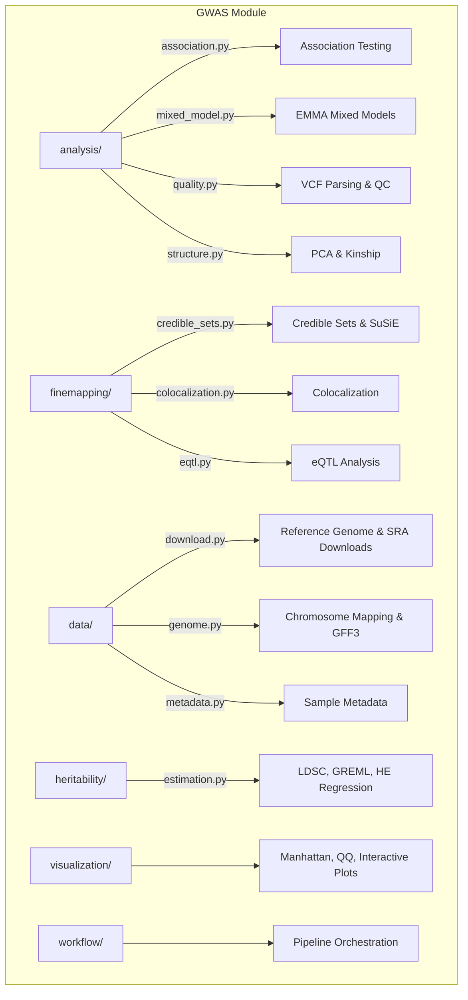

# GWAS Module

Genome-Wide Association Studies analysis, fine-mapping, and variant-expression integration.

## 📊 Architecture


```mermaid
graph TD
    subgraph "GWAS Module"
        A[analysis/] --> |association.py| AS[Association Testing]
        A --> |mixed_model.py| LM[EMMA Mixed Models]
        A --> |quality.py| QC[VCF Parsing & QC]
        A --> |structure.py| ST[PCA & Kinship]
        
        F[finemapping/] --> |credible_sets.py| CS[Credible Sets & SuSiE]
        F --> |colocalization.py| CO[Colocalization]
        F --> |eqtl.py| EQ[eQTL Analysis]
        
        D[data/] --> |download.py| DL[Reference Genome & SRA Downloads]
        D --> |genome.py| GN[Chromosome Mapping & GFF3]
        D --> |metadata.py| MD[Sample Metadata]
        
        H[heritability/] --> |estimation.py| HE[LDSC, GREML, HE Regression]
        
        V[visualization/] --> VIS[Manhattan, QQ, Interactive Plots]
        
        W[workflow/] --> WF[Pipeline Orchestration]
    end
```

## 🔑 Key Capabilities

### Fine-Mapping & Colocalization

```python
from metainformant.gwas.finemapping.colocalization import (
    eqtl_coloc,        # GWAS-eQTL colocalization
    multi_trait_coloc, # Multi-trait analysis
    compute_clpp,      # CLPP method
    regional_coloc,    # Regional analysis
)

# Test if GWAS signal colocalizes with expression QTL
result = eqtl_coloc(
    gwas_z=[1.2, 2.5, 3.1],  # GWAS Z-scores per variant
    eqtl_z=[1.1, 2.3, 2.9],  # eQTL Z-scores
    gene_id="LOC12345"
)
# Returns: PP_H4 (shared causal), interpretation, credible sets
```

### Association Testing

| Function | Purpose |
|----------|---------|
| `run_gwas()` | Full GWAS pipeline (via `workflow.workflow`) |
| `association_test_linear()` | Linear regression for quantitative traits |
| `association_test_logistic()` | Logistic regression for case-control |
| `association_test_mixed()` | EMMA mixed model with kinship correction |

### Data I/O

| Function | Purpose |
|----------|---------|
| `parse_vcf_full()` | Parse VCF files into genotype/variant dicts (via `analysis.quality`) |
| `download_reference_genome()` | Download reference genome from NCBI |
| `download_variant_database()` | Download dbSNP / 1000 Genomes data |
| `normalize_chromosome_name()` | Chromosome name normalization (NCBI acc, chr, roman) |
| `parse_gff3_genes()` | Parse GFF3 gene annotations |

## 📦 Submodules

| Module | Purpose |
|--------|---------|
| [`analysis/`](analysis/) | Association testing |
| [`data/`](data/) | VCF, PLINK I/O |
| [`finemapping/`](finemapping/) | Fine-mapping, colocalization |
| [`heritability/`](heritability/) | Heritability estimation |
| [`visualization/`](visualization/) | Manhattan, QQ, LocusZoom |
| [`workflow/`](workflow/) | Pipeline orchestration |

## 🧬 Integration with Expression Data

The GWAS module integrates with RNA-seq via the multiomics module:

```python
from metainformant.multiomics.analysis import integration
from metainformant.gwas.finemapping.colocalization import eqtl_coloc

# Convert GWAS and expression data to common format
dna_data = integration.from_dna_variants(gwas_sumstats)
rna_data = integration.from_rna_expression(expression_matrix)

# Run integrated analysis
integrated = integration.integrate_omics_data(
    dna_data=dna_data,
    rna_data=rna_data,
)
```

## 🔗 Related

- [metainformant.multiomics](../multiomics/) - Multi-omic integration
- [metainformant.rna](../rna/) - RNA-seq analysis
- [config/gwas/](../../../config/gwas/) - Configuration files
