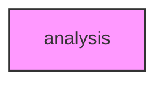

# ANALYSIS

## Overview
Functionality for analysis.

## 📦 Contents
- `[__init__.py](__init__.py)`
- `[association.py](association.py)`
- `[calling.py](calling.py)`
- `[correction.py](correction.py)`
- `[quality.py](quality.py)`
- `[structure.py](structure.py)`

## 📊 Structure



## Usage
Import module:
```python
from metainformant.metainformant.gwas.analysis import ...
```
