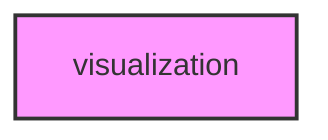

# VISUALIZATION

## Overview
Functionality for visualization.

## 📦 Contents
- `[__init__.py](__init__.py)`
- `[general.py](general.py)`
- `[visualization_comparison.py](visualization_comparison.py)`
- `[visualization_effects.py](visualization_effects.py)`
- `[visualization_genome.py](visualization_genome.py)`
- `[visualization_population.py](visualization_population.py)`
- `[visualization_regional.py](visualization_regional.py)`
- `[visualization_statistical.py](visualization_statistical.py)`
- `[visualization_suite.py](visualization_suite.py)`
- `[visualization_variants.py](visualization_variants.py)`

## 📊 Structure



## Usage
Import module:
```python
from metainformant.metainformant.gwas.visualization import ...
```
