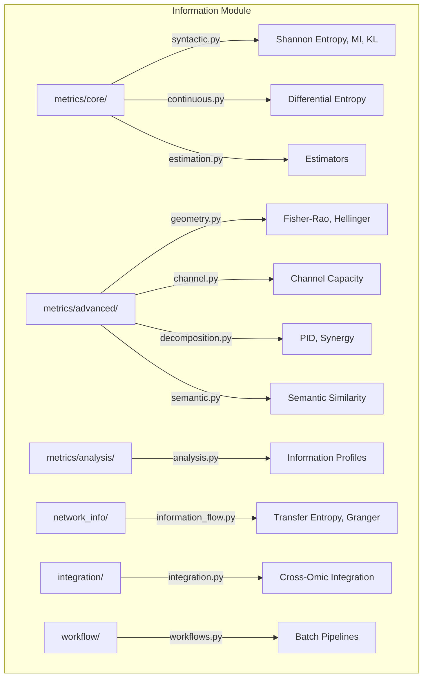

# Information Module

Information-theoretic analysis for biological sequences and multi-omic data, from Shannon entropy to Fisher-Rao geometry.

## Architecture



## Key Capabilities

### Core Measures

| Function | Module | Description |
|----------|--------|-------------|
| `shannon_entropy` | `metrics.core.syntactic` | Shannon entropy from probability distributions |
| `mutual_information` | `metrics.core.syntactic` | Mutual information between discrete variables |
| `kl_divergence` | `metrics.core.syntactic` | Kullback-Leibler divergence |
| `conditional_entropy` | `metrics.core.syntactic` | H(X\|Y) conditional entropy |
| `transfer_entropy` | `metrics.core.syntactic` | Directed information transfer with lag |
| `differential_entropy` | `metrics.core.continuous` | Entropy of continuous distributions |

### Advanced Measures

| Function | Module | Description |
|----------|--------|-------------|
| `fisher_rao_distance` | `metrics.advanced.geometry` | Geodesic distance on statistical manifolds |
| `channel_capacity` | `metrics.advanced.geometry` | Blahut-Arimoto channel capacity |
| `information_bottleneck` | `metrics.advanced.geometry` | Information bottleneck compression |
| `hellinger_distance` | `metrics.advanced.geometry` | Hellinger distance between distributions |
| `jensen_shannon_divergence` | `metrics.core.syntactic` | Symmetric divergence measure |

## Submodules

| Module | Purpose |
|--------|---------|
| [`metrics/core/`](metrics/core/) | Syntactic entropy, MI, KL divergence, continuous measures, estimators |
| [`metrics/advanced/`](metrics/advanced/) | Fisher-Rao geometry, channel capacity, decomposition, semantic similarity |
| [`metrics/analysis/`](metrics/analysis/) | Information profiles and advanced analysis pipelines |
| [`network_info/`](network_info/) | Transfer entropy, Granger causality, information flow networks |
| [`integration/`](integration/) | Cross-omic information integration (DNA, RNA, single-cell) |
| [`workflow/`](workflow/) | Batch entropy analysis and end-to-end pipelines |

## Quick Start

```python
from metainformant.information.metrics.core.syntactic import shannon_entropy, mutual_information, kl_divergence
from metainformant.information.metrics.core.continuous import differential_entropy
from metainformant.information.metrics.advanced.geometry import fisher_rao_distance
from metainformant.information.workflow.workflows import batch_entropy_analysis

# Shannon entropy of a nucleotide distribution
H = shannon_entropy([0.3, 0.2, 0.25, 0.25])

# Mutual information between two genomic features
mi = mutual_information(feature_x, feature_y)

# Fisher-Rao geodesic distance between distributions
dist = fisher_rao_distance([0.5, 0.3, 0.2], [0.4, 0.4, 0.2])

# Batch entropy analysis across sequences
results = batch_entropy_analysis(sequences=["ATCGATCG", "GCTAGCTA"], k=2)
```

## Integration

- **DNA** -- Sequence entropy profiles via `batch_entropy_analysis`
- **RNA** -- Expression variability measured with `differential_entropy`
- **Networks** -- Information flow with `transfer_entropy` and Granger causality
- **ML** -- Feature selection using `mutual_information` and `information_coefficient`

## Related

- [`metainformant.networks`](../networks/) -- Network analysis with information flow
- [`metainformant.dna.sequence`](../dna/sequence/) -- DNA sequence composition
- [`metainformant.ml`](../ml/) -- Feature selection using information metrics
- [`docs/information/`](../../../docs/information/) -- Information theory documentation
