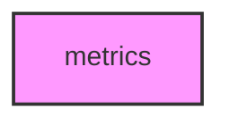

# METRICS

## Overview
Functionality for metrics.

## 📦 Contents
- `[__init__.py](__init__.py)`
- `[analysis.py](analysis.py)`
- `[continuous.py](continuous.py)`
- `[estimation.py](estimation.py)`
- `[semantic.py](semantic.py)`
- `[syntactic.py](syntactic.py)`

## 📊 Structure



## Usage
Import module:
```python
from metainformant.metainformant.information.metrics import ...
```
