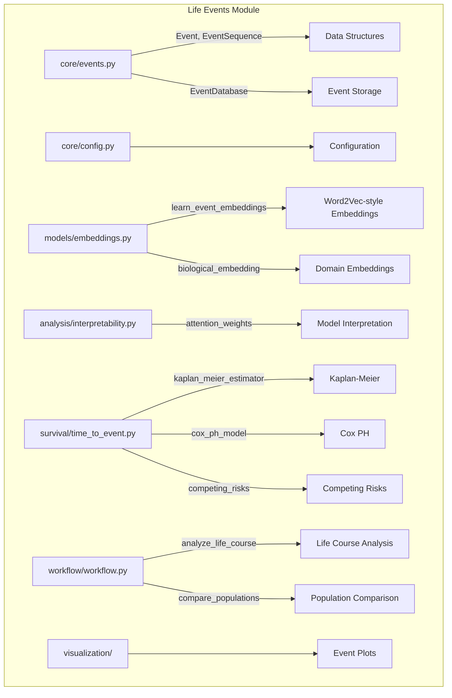

# Life Events Module

Life course event sequence analysis: temporal event modeling, embedding learning, survival analysis, and trajectory comparison.

## Architecture



## Key Capabilities

### Event Data Structures

```python
from metainformant.life_events.core.events import Event, EventSequence, EventDatabase

# Create events with temporal and domain information
event = Event(event_type="diagnosis", timestamp="2024-01-15", domain="health",
              attributes={"condition": "hypertension"})

# Build event sequences
seq = EventSequence(entity_id="patient_001")
seq.add_event(event)
```

### Embedding and Representation Learning

| Function | Module | Description |
|----------|--------|-------------|
| `learn_event_embeddings` | `models.embeddings` | Word2Vec-style event vector representations |
| `biological_embedding` | `models.embeddings` | Domain-specific embeddings (event_type, domain, temporal) |
| `domain_specific_embeddings` | `models.embeddings` | Embeddings per life domain |

### Survival Analysis

| Function | Module | Description |
|----------|--------|-------------|
| `kaplan_meier_estimator` | `survival.time_to_event` | Kaplan-Meier survival curves |
| `cox_ph_model` | `survival.time_to_event` | Cox proportional hazards regression |
| `competing_risks` | `survival.time_to_event` | Competing risks analysis |
| `recurrent_events` | `survival.time_to_event` | Recurrent event modeling |
| `time_varying_covariates` | `survival.time_to_event` | Time-varying covariate handling |

### Workflows

| Function | Module | Description |
|----------|--------|-------------|
| `analyze_life_course` | `workflow.workflow` | End-to-end life course analysis pipeline |
| `compare_populations` | `workflow.workflow` | Cross-population trajectory comparison |
| `intervention_analysis` | `workflow.workflow` | Intervention effect estimation |
| `event_importance` | `workflow.workflow` | Feature importance for event prediction |

## Submodules

| Module | Purpose |
|--------|---------|
| [`core/`](core/) | Event, EventSequence, EventDatabase data structures and configuration |
| [`models/`](models/) | Event embeddings and representation learning |
| [`analysis/`](analysis/) | Model interpretability, attention weights, feature attribution |
| [`survival/`](survival/) | Kaplan-Meier, Cox PH, competing risks, recurrent events |
| [`visualization/`](visualization/) | Event timeline and survival curve plots |
| [`workflow/`](workflow/) | Life course analysis, population comparison, intervention analysis |

## Quick Start

```python
from metainformant.life_events.core.events import Event, EventSequence
from metainformant.life_events.models.embeddings import learn_event_embeddings
from metainformant.life_events.survival.time_to_event import kaplan_meier_estimator
from metainformant.life_events.workflow.workflow import analyze_life_course

# Build event sequences
seq = EventSequence(entity_id="subject_001")
seq.add_event(Event(event_type="job_change", timestamp="2023-06-01", domain="occupation"))
seq.add_event(Event(event_type="diagnosis", timestamp="2024-01-15", domain="health"))

# Learn embeddings across a cohort
embeddings = learn_event_embeddings(sequences=[seq], embedding_dim=64)

# Kaplan-Meier survival estimation
km = kaplan_meier_estimator(times=[12, 24, 36, 48], events=[1, 0, 1, 1])

# Full life course analysis pipeline
results = analyze_life_course(sequences=[seq], output_dir="output/life_events")
```

## Integration

- **Phenotype** -- Life course events integrate with `metainformant.phenotype.analysis.life_course`
- **Information** -- Sequence entropy from `metainformant.information` quantifies event complexity
- **ML** -- Embedding vectors feed into `metainformant.ml` classification and clustering

## Related

- [`metainformant.phenotype`](../phenotype/) -- Trait and phenotype analysis
- [`metainformant.information`](../information/) -- Information-theoretic measures
- [`metainformant.ml`](../ml/) -- Machine learning pipelines
- [`docs/life_events/`](../../../docs/life_events/) -- Life events documentation
