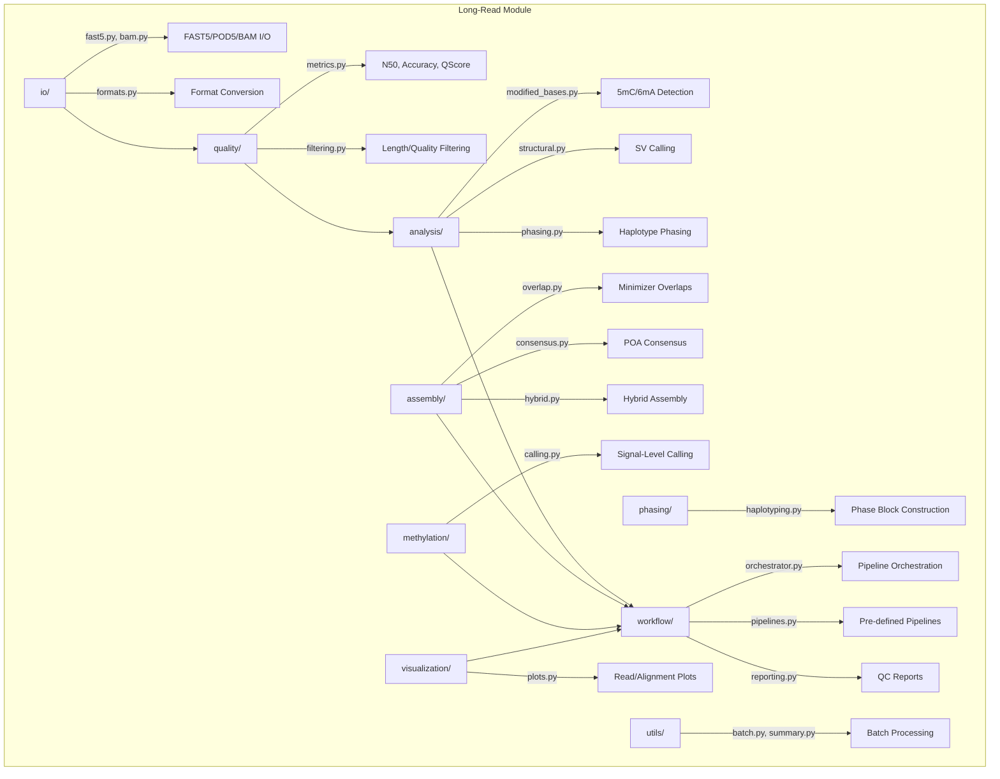

# Long-Read Sequencing Module

PacBio and Oxford Nanopore long-read analysis: signal I/O, quality assessment, assembly, methylation calling, haplotype phasing, and structural variant detection.

## Architecture



## Submodules

| Module | Purpose |
|--------|---------|
| [`io/`](io/) | FAST5, POD5, BAM reading/writing and format conversion |
| [`quality/`](quality/) | Read metrics (N50, Nx, accuracy), filtering by length/quality |
| [`analysis/`](analysis/) | Modified base detection, structural variants, phasing |
| [`assembly/`](assembly/) | Minimizer overlaps, POA consensus, hybrid assembly |
| [`methylation/`](methylation/) | Signal-level methylation calling and DMR detection |
| [`phasing/`](phasing/) | Read-based haplotyping and switch error computation |
| [`workflow/`](workflow/) | Pipeline orchestration with dependency resolution |
| [`visualization/`](visualization/) | Read length, quality, alignment, and methylation plots |
| [`utils/`](utils/) | Batch processing and run summary generation |

## Key Classes

### Pipeline Orchestration

- `LongReadOrchestrator` - End-to-end pipeline engine with dependency resolution
- `PipelineStep` - Individual pipeline step definition
- `PipelineResult` - Step execution results and metadata

### Pipeline Stages

| Builder | Description |
|---------|-------------|
| `_build_qc_steps` | Quality assessment and read filtering |
| `_build_assembly_steps` | Overlap detection through consensus polishing |
| `_build_methylation_steps` | Signal-level methylation calling pipeline |
| `_build_sv_steps` | Structural variant detection from split reads |

## Quick Start

```python
from metainformant.longread.workflow.orchestrator import LongReadOrchestrator, PipelineStep
from metainformant.longread.io import fast5, bam
from metainformant.longread.quality import metrics, filtering

# Run a full long-read pipeline
orchestrator = LongReadOrchestrator()
result = orchestrator.run(input_dir="data/nanopore_run/")

# Or work with individual submodules
from metainformant.longread.analysis import modified_bases, structural
from metainformant.longread.assembly import overlap, consensus, hybrid
from metainformant.longread.methylation import calling
from metainformant.longread.phasing import haplotyping
```

## Integration

Long-read data integrates with other METAINFORMANT modules for multi-omic analysis:

```python
from metainformant.longread.analysis import structural
from metainformant.structural_variants import population

# SV calls from long reads feed into population-level SV analysis
sv_calls = structural.call_variants(alignments)
pop_result = population.analyze(sv_calls, sample_metadata)
```

## Related

- [docs/longread/](../../../docs/longread/) - Long-read analysis documentation
- [metainformant.structural_variants](../structural_variants/) - Population-level SV analysis
- [metainformant.epigenome](../epigenome/) - Methylation and chromatin analysis
- [metainformant.quality](../quality/) - General QC metrics
