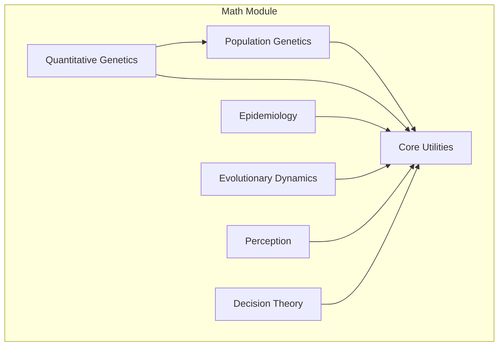

# Mathematical Biology Module

The `math` module provides theoretical and quantitative biology tools, implementing mathematical models from evolutionary theory, population genetics, and decision-making processes.

## Module Architecture

This module is organized into domain-specific submodules:

- **[population_genetics](population_genetics/README.md)**: Theory of allele frequency changes, coalescent theory, and demography.
- **[epidemiology](epidemiology/README.md)**: Disease dynamics models (SIR, SEIR, SIS).
- **[quantitative_genetics](quantitative_genetics/README.md)**: Trait evolution, Price equation, and heritability.
- **[evolutionary_dynamics](evolutionary_dynamics/README.md)**: Population dynamics, game theory, and ecological models.
- **[perception](perception/README.md)**: Psychophysics and Signal Detection Theory.
- **[decision_theory](decision_theory/README.md)**: Drift-diffusion models for behavioral analysis.
- **[core](core/README.md)**: Shared utilities and visualization tools.

### Visual Overview



## Usage

The module maintains backward compatibility, so you can still import functions from the top-level `metainformant.math` package, or import from specific submodules.

```python
# Legacy style (still supported)
from metainformant.math import sir_step, tajimas_D

# Modern style (recommended)
from metainformant.math.epidemiology import sir_step
from metainformant.math.population_genetics import tajimas_D
```

## Submodules

### Population Genetics
Contains `core`, `statistics`, `coalescent`, `demography`, `effective_size`, `fst`, `ld`, and `selection`.

### Epidemiology
Contains `models` for disease transmission (SIR, SEIR, SIS) and reproduction number calculations.

### Quantitative Genetics
Contains `core` metrics (heritability) and `price` equation analysis.

### Evolutionary Dynamics
Contains `core` dynamics (Logistic map, Lotka-Volterra) and `egt` (Evolutionary Game Theory).

### Perception
Contains `psychophysics` (Weber, Fechner, Stevens) and `signal_detection` (d', beta, criterion).

### Decision Theory
Contains `ddm` (Drift-Diffusion Models).

### Core
Contains `utilities` (statistical helpers) and `visualization`.

## Dependencies

- **numpy**: Required for numerical computations.
- **scipy**: Optional but recommended for advanced statistical tests.
- **matplotlib**: Optional for visualization.

For more details, see the README in each submodule.
