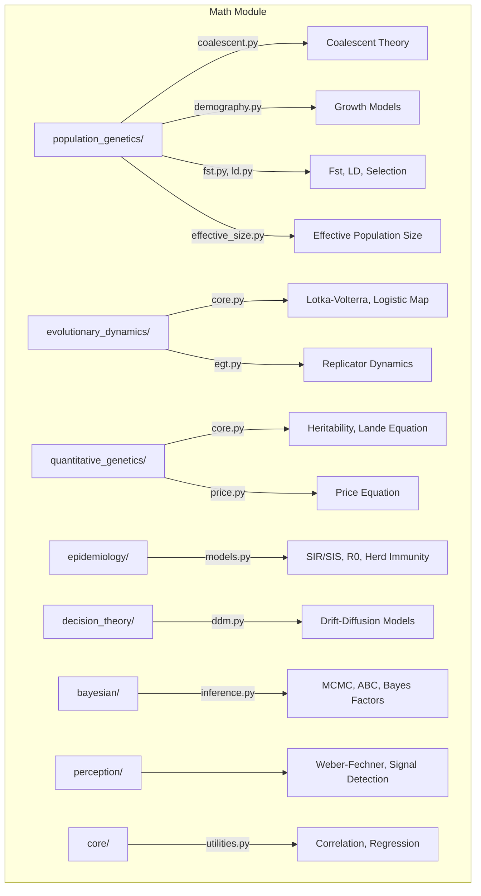

# Math Module

Mathematical biology and theoretical modeling for population genetics, epidemiology, evolutionary dynamics, and quantitative genetics.

## Architecture



## Key Capabilities

### Population Genetics

| Function | Module | Description |
|----------|--------|-------------|
| `expected_time_to_mrca` | `population_genetics.coalescent` | Expected TMRCA for n samples |
| `watterson_theta` | `population_genetics.coalescent` | Watterson's theta from segregating sites |
| `exponential_growth_model` | `population_genetics.demography` | Exponential demographic growth |
| `logistic_growth_model` | `population_genetics.demography` | Logistic carrying-capacity growth |

```python
from metainformant.math.population_genetics.coalescent import expected_time_to_mrca, watterson_theta
from metainformant.math.population_genetics.demography import logistic_growth_model

tmrca = expected_time_to_mrca(n_samples=10, effective_size=1000.0)
theta = watterson_theta(S=42, n=20)
pop_sizes = logistic_growth_model(initial_size=100, carrying_capacity=10000, growth_rate=0.1, generations=50)
```

### Evolutionary Dynamics

| Function | Module | Description |
|----------|--------|-------------|
| `replicator_derivative` | `evolutionary_dynamics.egt` | Replicator equation derivatives |
| `replicator_step` | `evolutionary_dynamics.egt` | Euler step for replicator dynamics |
| `logistic_map` | `evolutionary_dynamics.core` | Discrete logistic map iterations |
| `lotka_volterra_step` | `evolutionary_dynamics.core` | Predator-prey dynamics step |

```python
from metainformant.math.evolutionary_dynamics.egt import replicator_derivative, replicator_step
from metainformant.math.evolutionary_dynamics.core import logistic_map, lotka_volterra_step

# Hawk-Dove game dynamics
derivs = replicator_derivative(fitnesses=[1.5, 1.0], frequencies=[0.6, 0.4])
new_freqs = replicator_step(fitnesses=[1.5, 1.0], frequencies=[0.6, 0.4], time_step=0.01)

# Predator-prey system
prey, pred = lotka_volterra_step(prey=100.0, predator=20.0, alpha=1.0, beta=0.1)
```

### Quantitative Genetics

| Function | Module | Description |
|----------|--------|-------------|
| `narrow_sense_heritability` | `quantitative_genetics.core` | h-squared from variance components |
| `lande_equation_response` | `quantitative_genetics.core` | Multivariate response to selection |
| `price_equation` | `quantitative_genetics.price` | Price equation decomposition |

```python
from metainformant.math.quantitative_genetics.core import narrow_sense_heritability, lande_equation_response
from metainformant.math.quantitative_genetics.price import price_equation

h2 = narrow_sense_heritability(additive_genetic_variance=0.3, phenotypic_variance=1.0)
cov_term, trans_term, total = price_equation(fitness=[1.2, 0.8], parent=[5.0, 3.0], offspring=[5.5, 2.8])
```

### Epidemiology

```python
from metainformant.math.epidemiology.models import basic_reproduction_number, herd_immunity_threshold, sir_step

r0 = basic_reproduction_number(transmission_rate=0.3, recovery_rate=0.1)
threshold = herd_immunity_threshold(R0=r0)
S, I, R = sir_step(S=990, I=10, R=0, beta=0.3, gamma=0.1, N=1000)
```

## Submodules

| Module | Purpose |
|--------|---------|
| [`population_genetics/`](population_genetics/) | Coalescent theory, demography, Fst, LD, selection, effective size |
| [`evolutionary_dynamics/`](evolutionary_dynamics/) | Lotka-Volterra, logistic map, replicator dynamics, game theory |
| [`quantitative_genetics/`](quantitative_genetics/) | Heritability, breeder's equation, Lande's equation, Price equation |
| [`epidemiology/`](epidemiology/) | SIR/SIS models, R0, herd immunity threshold |
| [`decision_theory/`](decision_theory/) | Drift-diffusion models for decision processes |
| [`bayesian/`](bayesian/) | MCMC sampling, ABC, Bayes factors, information criteria (DIC, WAIC) |
| [`perception/`](perception/) | Psychophysics (Weber-Fechner, Stevens), signal detection theory |
| [`core/`](core/) | Statistical utilities (correlation, linear regression, visualization) |

## Quick Start

```python
from metainformant.math.population_genetics.coalescent import expected_time_to_mrca, watterson_theta
from metainformant.math.evolutionary_dynamics.egt import replicator_derivative

# Coalescent: expected TMRCA for 20 samples, Ne=5000
tmrca = expected_time_to_mrca(n_samples=20, effective_size=5000.0)

# Watterson's theta from segregating sites
theta = watterson_theta(S=50, n=20)

# Evolutionary game theory: hawk-dove dynamics
derivs = replicator_derivative(fitnesses=[1.5, 1.0], frequencies=[0.6, 0.4])
```

## Integration

Math functions underpin analysis across METAINFORMANT modules:

- **GWAS** -- Population structure correction uses Fst, LD calculations from `population_genetics`
- **DNA** -- Phylogenetic analysis uses coalescent expectations from `population_genetics.coalescent`
- **Simulation** -- Agent-based models use Lotka-Volterra and replicator dynamics from `evolutionary_dynamics`
- **Ecology** -- Species abundance models connect to logistic growth from `population_genetics.demography`
- **Information** -- Entropy measures bridge `information` and `epidemiology` (R0 as information flow)

## Related

- [`metainformant.dna.population`](../dna/population/) -- Empirical population genetics analysis
- [`metainformant.simulation`](../simulation/) -- Simulation models using math foundations
- [`metainformant.gwas`](../gwas/) -- GWAS workflows using population genetics theory
- [`metainformant.ecology`](../ecology/) -- Community ecology using diversity theory
- [`docs/math/`](../../../docs/math/) -- Mathematical biology documentation
