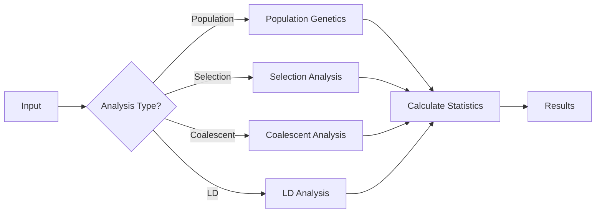

# Mathematical Biology Module

The `math` module provides theoretical and quantitative biology tools, implementing mathematical models from evolutionary theory, population genetics, and decision-making processes.

## Overview

This module contains implementations of key mathematical frameworks in theoretical biology:
- **Population Genetics**: Price equation, kin selection, multilevel selection
- **Decision Theory**: Drift-diffusion models for behavioral analysis
- **Evolutionary Dynamics**: Selection experiments and quantitative trait analysis
- **Statistical Methods**: Epidemiological models and linkage disequilibrium

### Module Architecture


### Mathematical Biology Workflow



## Submodules

### Population Genetics (`price.py`, `selection.py`, `popgen.py`)
Mathematical models of evolutionary processes.

**Key Features:**
- Price equation decomposition of evolutionary change
- Hamilton's rule for kin selection
- Multilevel selection theory
- Heritability and response to selection calculations

**Usage:**
```python
from metainformant.math import price_equation, kin_selection_response

# Price equation analysis
fitness = [0.2, 0.4, 0.1]
trait_parent = [1.0, 1.2, 0.9]
trait_offspring = [1.25, 1.35, 0.95]
cov_term, trans_term, total = price_equation(fitness, trait_parent, trait_offspring)

# Kin selection analysis
response = kin_selection_response(
    relatedness=0.5,
    benefit=0.4,
    cost=0.1
)
```

### Decision Theory (`ddm.py`)
Drift-diffusion models for decision-making processes.

**Key Features:**
- Analytic accuracy calculations
- Mean decision time computation
- Parameter estimation and fitting
- Model comparison and validation

**Usage:**
```python
from metainformant.math import ddm_analytic_accuracy, ddm_mean_decision_time

# DDM analysis
accuracy = ddm_analytic_accuracy(drift_rate=0.5, threshold=1.0, noise=0.1)
decision_time = ddm_mean_decision_time(drift_rate=0.5, threshold=1.0, noise=0.1)
```

### Population Dynamics (`dynamics.py`)
Mathematical models of population dynamics and ecological processes.

**Key Features:**
- Logistic growth models
- Lotka-Volterra competition/predation
- Population stability analysis
- Phase space analysis and attractors

**Usage:**
```python
from metainformant.math import logistic_map, lotka_volterra_step

# Logistic map iteration
growth_curve = logistic_map(r=3.5, x0=0.5, steps=100)

# Lotka-Volterra predator-prey dynamics (single step)
prey_next, predator_next = lotka_volterra_step(
    prey=100.0,
    predator=10.0,
    alpha=1.0,  # Prey growth rate
    beta=0.1,   # Predation rate
    delta=0.075,  # Predator efficiency
    gamma=1.5,  # Predator death rate
    dt=0.01
)
```

### Evolutionary Experiments (`selection_experiments/`)
Natural selection simulation framework with signal processing constraints.

**Key Features:**
- Structural vs. quality trait evolution
- Signal fidelity modeling
- Selection dynamics simulation
- Multi-generation evolutionary experiments

**Usage:**
```python
from metainformant.math.selection_experiments import simulate_generation, simulate_generations

# Single generation simulation
result = simulate_generation(
    s=np.random.normal(0, 1, 10000),
    s_hat=0.8
)

# Multi-generation evolution
results = simulate_generations(
    generations=50,
    n=10000,
    s_hat=0.6
)
```

### Epidemiology (`epidemiology.py`)
Mathematical models of disease dynamics.

**Key Features:**
- SIR (Susceptible-Infected-Recovered) models
- Parameter estimation from data
- Model fitting and validation
- Scenario simulation and forecasting

**Usage:**
```python
from metainformant.math import sir_step, seir_step, sis_step, basic_reproduction_number

# SIR model single time step
S, I, R = 990.0, 10.0, 0.0
beta, gamma = 0.3, 0.1
S_next, I_next, R_next = sir_step(S, I, R, beta, gamma, dt=0.01)

# Calculate basic reproduction number
R0 = basic_reproduction_number(beta=0.3, gamma=0.1)
```

### Population Genetics (`popgen.py`, `fst.py`, `ld.py`)
Population genetic statistics and analysis.

**Key Features:**
- Fst calculation and interpretation
- Linkage disequilibrium analysis
- Population structure inference
- Genetic diversity metrics

**Usage:**
```python
from metainformant.math import fst_from_heterozygosity, fst_from_allele_freqs
from metainformant.math import ld_coefficients, r_squared

# Population differentiation from heterozygosity
fst_value = fst_from_heterozygosity(Hs=0.4, Ht=0.5)

# Fst from allele frequencies
subpop_freqs = [0.2, 0.3, 0.25, 0.28]
fst = fst_from_allele_freqs(subpop_freqs)

# Linkage disequilibrium
pA, pa, pB, pb = 0.6, 0.4, 0.7, 0.3
haplotype_pAB = 0.5
D, D_prime = ld_coefficients(pA, pa, pB, pb, haplotype_pAB)
r2 = r_squared(pA, pa, pB, pb, haplotype_pAB)
```

### Coalescent Theory (`coalescent.py`)
Coalescent models for genealogical processes.

**Key Features:**
- Coalescent tree simulation
- Time to most recent common ancestor
- Population size estimation
- Demographic inference

**Usage:**
```python
from metainformant.math import expected_time_to_mrca, expected_total_branch_length
from metainformant.math import tajimas_D, expected_pairwise_diversity

# Expected time to most recent common ancestor
n = 10
Ne = 1000
t_mrca = expected_time_to_mrca(n, Ne)

# Expected total branch length
total_length = expected_total_branch_length(n, Ne)

# Tajima's D calculation
segregating_sites = [1, 0, 1, 1, 0, 1, 0, 0, 1, 1]  # Binary site pattern
d = tajimas_D(segregating_sites, Ne=1000)
```

## Theoretical Background

### Price Equation
The Price equation provides a general framework for understanding evolutionary change:
```
Δ̄z = Cov(w, z) + E(wΔz)
```
Where Δ̄z is the change in average trait value, Cov(w, z) represents natural selection, and E(wΔz) represents transmission bias.

### Kin Selection
Hamilton's rule states that a trait will be favored by selection when:
```
rB > C
```
Where r is the genetic relatedness, B is the benefit to the recipient, and C is the cost to the actor.

### Drift-Diffusion Models
DDMs model decision-making as a stochastic process where evidence accumulates over time until a threshold is reached.

## Integration with Other Modules

### With DNA Population Genetics Module
```python
from metainformant.dna import population
from metainformant.math import price_equation, tajimas_D

# Combine empirical population genetics with theoretical models
sequences = population.read_sequences("populations.fasta")

# Calculate empirical statistics
nuc_diversity = population.nucleotide_diversity(sequences)
tajima_d = population.tajimas_D(sequences)

# Use theoretical models to interpret results
# Price equation for selection analysis
fitness = calculate_fitness_from_diversity(nuc_diversity)
# Apply Price equation to understand evolutionary forces
```

### With GWAS Module
```python
from metainformant.math import price_equation
from metainformant.gwas import association_test_linear

# Statistical models for GWAS
# Use mathematical models to interpret association results
# Price equation for selection on genetic variants
```

### With DNA Module
```python
from metainformant.dna import population
from metainformant.math import price_equation

# Theoretical analysis of DNA diversity
pi = population.nucleotide_diversity(sequences)
# Price equation with fitness and trait values
cov, trans, total = price_equation(fitness_values, trait_parent, trait_offspring)
```

### With Simulation Module
```python
from metainformant.math import ddm_analytic_accuracy
from metainformant.simulation import agents

# Use DDM in agent-based models
accuracy = ddm_analytic_accuracy(drift_rate, threshold, noise)
agent_decision = agents.make_decision(accuracy)
```

## Mathematical Rigor

All implementations are based on peer-reviewed mathematical literature and include:
- Proper handling of edge cases and numerical stability
- Comprehensive parameter validation
- Clear documentation of assumptions and limitations
- References to original theoretical work

## Performance Features

- **Numerical Stability**: Robust algorithms for floating-point computations
- **Vectorization**: NumPy-based implementations for efficiency
- **Caching**: Expensive computations are cached when appropriate
- **Parallel Processing**: CPU-intensive simulations support parallel execution

## Testing

Comprehensive tests ensure mathematical correctness:
- Verification against known analytical solutions
- Numerical stability testing
- Performance benchmarking
- Edge case handling validation

## Dependencies

### Required
- **numpy**: Required for `popgen_stats` module and various numerical computations

### Optional
- **scipy**: Optional but recommended for advanced statistical functions:
  - `hardy_weinberg_test()` - Chi-square test for Hardy-Weinberg equilibrium
  - `fisher_exact_test()` - Fisher's exact test for 2x2 contingency tables
  - `ewens_watterson_test()` - Ewens-Watterson test for neutrality
  - `detect_outliers()` - FDR correction for multiple testing
  - `compare_statistics()` - Statistical tests (t-test, Mann-Whitney, etc.)

Install optional dependencies:
```bash
# Install with scientific dependencies
pip install metainformant[scientific]

# Or install scipy directly
pip install scipy
```

### Visualization (Optional)
- **matplotlib**: Used in `selection_experiments` submodule for plotting

## Usage Examples

### Price Equation Analysis
```python
from metainformant.math import price_equation

# Analyze evolutionary change
trait_parent = [1.0, 1.2, 0.9, 1.1, 0.8]
fitness = [0.2, 0.4, 0.1, 0.3, 0.2]
trait_offspring = [1.25, 1.35, 0.95, 1.15, 0.85]

cov_term, trans_term, total_change = price_equation(
    fitness, trait_parent, trait_offspring
)

print(f"Covariance (selection) component: {cov_term:.4f}")
print(f"Transmission component: {trans_term:.4f}")
print(f"Total change: {total_change:.4f}")
```

### Selection Experiments
```python
from metainformant.math.selection_experiments import simulate_generations

# Run evolutionary simulation
results = simulate_generations(
    generations=100,
    n=10000,
    s_hat=0.7,  # Signal fidelity
    fitness_fn=lambda s: s**2  # Quadratic fitness
)

# Analyze results
correlation = results.correlation_s_q()
selection_gradient = results.selection_gradient()
```

This module provides rigorous mathematical tools for theoretical biology, enabling quantitative analysis of evolutionary and behavioral processes.
