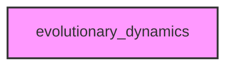

# EVOLUTIONARY_DYNAMICS

## Overview
Functionality for evolutionary_dynamics.

## 📦 Contents
- `[__init__.py](__init__.py)`
- `[core.py](core.py)`
- `[egt.py](egt.py)`

## 📊 Structure



## Usage
Import module:
```python
from metainformant.metainformant.math.evolutionary_dynamics import ...
```
