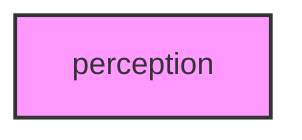

# PERCEPTION

## Overview
Perception and Psychophysics submodule.

## 📦 Contents
- `[__init__.py](__init__.py)`
- `[psychophysics.py](psychophysics.py)`
- `[signal_detection.py](signal_detection.py)`

## 📊 Structure



## Usage
Import module:
```python
from metainformant.math.perception import ...
```
