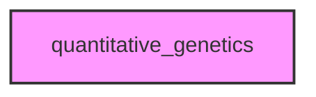

# QUANTITATIVE_GENETICS

## Overview
Functionality for quantitative_genetics.

## 📦 Contents
- `[__init__.py](__init__.py)`
- `[core.py](core.py)`
- `[price.py](price.py)`

## 📊 Structure



## Usage
Import module:
```python
from metainformant.metainformant.math.quantitative_genetics import ...
```
