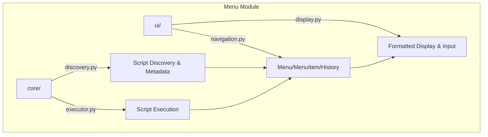

# Menu Module

Interactive command-line menu system for METAINFORMANT -- script discovery, navigation, execution, and formatted display.

## Architecture



## Key Capabilities

### Script Discovery

```python
from metainformant.menu.core.discovery import extract_script_metadata, categorize_script
from pathlib import Path

info = extract_script_metadata(Path("scripts/rna/run_workflow.py"))
print(info.name, info.category, info.description)

category = categorize_script(Path("scripts/gwas/run_analysis.py"))  # "gwas"
```

| Class/Function | Description |
|----------------|-------------|
| `ScriptInfo` | Metadata dataclass: path, name, description, category, args |
| `extract_script_metadata` | Parse docstrings and argparse from script files |
| `categorize_script` | Assign category from directory structure |

### Navigation

```python
from metainformant.menu.ui.navigation import Menu, MenuItem, MenuHistory

menu = Menu(
    id="main",
    title="METAINFORMANT",
    items=[
        MenuItem(id="rna", label="RNA-seq Workflows", action="submenu:rna"),
        MenuItem(id="gwas", label="GWAS Analysis", action="submenu:gwas"),
    ]
)

history = MenuHistory()
history.push("main", "METAINFORMANT")
```

### Execution

```python
from metainformant.menu.core.executor import validate_script_executable, prompt_for_args

is_valid = validate_script_executable(Path("scripts/rna/run_workflow.py"))
args = prompt_for_args(script_info)  # Interactive argument prompting
```

### Display

```python
from metainformant.menu.ui.display import format_menu, show_menu

formatted = format_menu(menu.items, title="RNA-seq Workflows", width=80)
show_menu(menu.items, title="RNA-seq Workflows")  # Print to stdout
```

## Submodules

| Module | Purpose |
|--------|---------|
| [`core/`](core/) | Script discovery (`ScriptInfo`, `extract_script_metadata`) and execution (`validate_script_executable`) |
| [`ui/`](ui/) | Menu navigation (`Menu`, `MenuItem`, `MenuHistory`) and display formatting (`format_menu`, `show_menu`) |

## Quick Start

```python
from metainformant.menu.core.discovery import extract_script_metadata
from metainformant.menu.ui.navigation import Menu, MenuItem
from metainformant.menu.ui.display import format_menu
from pathlib import Path

# Discover scripts and build a menu
scripts = [extract_script_metadata(p) for p in Path("scripts/rna").glob("*.py")]
items = [MenuItem(id=s.name, label=s.name, description=s.description) for s in scripts]
menu = Menu(id="rna", title="RNA Workflows", items=items)

# Display formatted menu
print(format_menu(menu.items, title=menu.title))
```

## Related

- [`metainformant.core`](../core/) -- Shared utilities used by menu system
- [`scripts/`](../../../scripts/) -- Discoverable analysis scripts
- [`docs/menu/`](../../../docs/menu/) -- Menu system documentation
