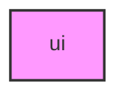

# UI

## Overview
Functionality for ui.

## 📦 Contents
- `[__init__.py](__init__.py)`
- `[display.py](display.py)`
- `[navigation.py](navigation.py)`

## 📊 Structure



## Usage
Import module:
```python
from metainformant.metainformant.menu.ui import ...
```
