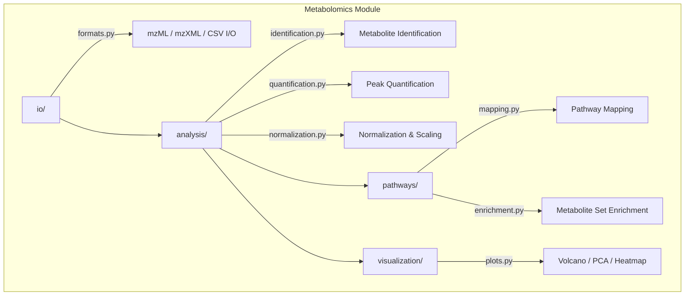

# Metabolomics Module

Metabolomics analysis: mass spectrometry data processing, metabolite identification, pathway mapping, and metabolite-gene integration.

## Architecture



## Submodules

| Module | Purpose |
|--------|---------|
| [`io/`](io/) | Mass spectrometry file reading (mzML, mzXML, CSV), format conversion |
| [`analysis/`](analysis/) | Metabolite identification, peak quantification, normalization |
| [`pathways/`](pathways/) | KEGG/Reactome pathway mapping, metabolite set enrichment |
| [`visualization/`](visualization/) | Volcano plots, PCA ordination, concentration heatmaps |

## Quick Start

```python
from metainformant.metabolomics.io import formats
from metainformant.metabolomics.analysis import identification
from metainformant.metabolomics.pathways import enrichment

# Load mass spec data
data = formats.read_csv("metabolomics_data.csv")

# Identify metabolites and map to pathways
identified = identification.identify_metabolites(data, database="hmdb")
enriched = enrichment.metabolite_set_enrichment(identified, pathway_db="kegg")
```

## Related

- [metainformant.multiomics](../multiomics/) - Multi-omic integration
- [metainformant.protein](../protein/) - Protein-metabolite interactions
- [metainformant.visualization](../visualization/) - General plotting
