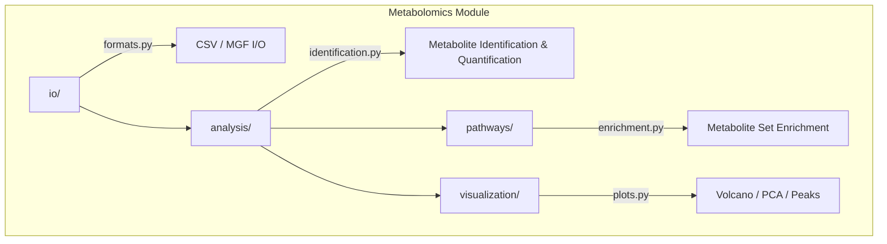

# Metabolomics Module

Metabolomics analysis: mass spectrometry data processing, metabolite identification, pathway mapping, and metabolite-gene integration.

## Overview

Metabolomics analysis: mass spectrometry data processing, metabolite identification, pathway mapping, and metabolite-gene integration.


## Table of Contents

- [Architecture](#architecture)
- [Submodules](#submodules)
- [Quick Start](#quick-start)
- [Related](#related)

## Architecture


```mermaid
graph TD
    subgraph "Metabolomics Module"
        IO[io/] --> |formats.py| FMT[CSV / MGF I/O]

        AN[analysis/] --> |identification.py| ID[Metabolite Identification & Quantification]

        PW[pathways/] --> |enrichment.py| PE[Metabolite Set Enrichment]

        VZ[visualization/] --> |plots.py| PL[Volcano / PCA / Peaks]
    end

    IO --> AN
    AN --> PW
    AN --> VZ
```

## Submodules

| Module | Purpose |
|--------|---------|
| [`io/`](io/) | Intensity-matrix CSV I/O and MGF (Mascot Generic Format) spectrum reading/writing, spectra filtering, extracted-ion chromatograms |
| [`analysis/`](analysis/) | Metabolite identification (`identify_metabolites`, `identify_with_adducts`), normalization, fold change, differential abundance, imputation, spectral similarity |
| [`pathways/`](pathways/) | Over-representation analysis (`metabolite_set_enrichment`), Benjamini-Hochberg FDR, pathway activity scoring |
| [`visualization/`](visualization/) | Volcano plot data, PCA ordination, heatmap data, chromatographic peak detection, spectrum plot prep, RT alignment |

## Quick Start

```python
import numpy as np
from metainformant.metabolomics.io import formats
from metainformant.metabolomics.analysis import identification
from metainformant.metabolomics.pathways import enrichment

# Load an intensity matrix (first column = metabolite IDs, first row = samples)
data = formats.read_csv("metabolomics_data.csv")

# Identify metabolites by matching observed m/z against a reference of exact masses
database = {"glucose": 180.0634, "citrate": 192.0270, "lactate": 90.0317}
identified = identification.identify_metabolites(
    np.array([180.0641, 192.0279]), database, ppm_tolerance=10.0
)

# Over-representation analysis against a pathway database
pathway_db = {"glycolysis": ["glucose", "lactate"], "TCA_cycle": ["citrate"]}
enriched = enrichment.metabolite_set_enrichment(["glucose", "lactate"], pathway_db)
```

## Related
- [API Reference](SPEC.md) — Type signatures, error codes, data structures

- [metainformant.multiomics](../multiomics/) - Multi-omic integration
- [metainformant.protein](../protein/) - Protein-metabolite interactions
- [metainformant.visualization](../visualization/) - General plotting
