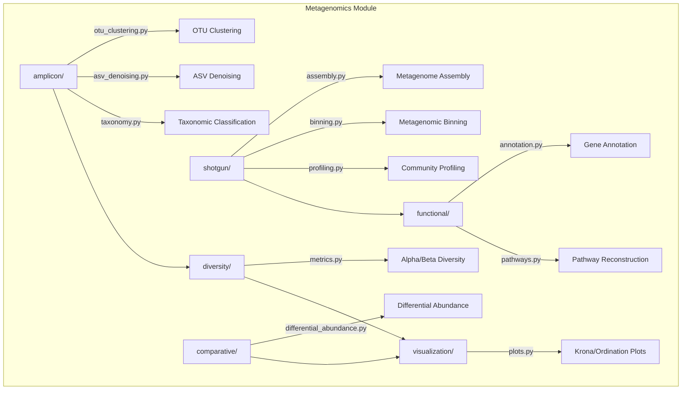

# Metagenomics Module

Microbiome and metagenomic analysis: amplicon profiling (16S/ITS), shotgun metagenomics, community diversity, functional annotation, and differential abundance testing.

## Architecture



## Submodules

| Module | Purpose |
|--------|---------|
| [`amplicon/`](amplicon/) | OTU clustering, ASV denoising, taxonomic classification |
| [`shotgun/`](shotgun/) | Metagenome assembly, binning, community profiling |
| [`diversity/`](diversity/) | Alpha diversity (Shannon, Simpson, Chao1), beta diversity (Bray-Curtis, Jaccard, Aitchison), PERMANOVA, ordination |
| [`functional/`](functional/) | Gene annotation, ORF prediction, metabolic pathway reconstruction |
| [`comparative/`](comparative/) | Differential abundance (ALDEx2-like, ANCOM-like), LEfSe-style effect sizes, biomarker discovery |
| [`visualization/`](visualization/) | Krona charts, stacked bar plots, rarefaction curves, ordination plots |

## Key Capabilities

### Amplicon Analysis

```python
from metainformant.metagenomics.amplicon import otu_clustering, asv_denoising, taxonomy

otus = otu_clustering.cluster(sequences, threshold=0.97)
asvs = asv_denoising.denoise(sequences)
classified = taxonomy.classify(asvs)
```

### Shotgun Metagenomics

```python
from metainformant.metagenomics.shotgun import assembly, binning, profiling

contigs = assembly.assemble(reads)
bins = binning.bin_contigs(contigs, coverage)
profile = profiling.profile_community(reads)
```

### Community Diversity

| Metric Type | Methods |
|-------------|---------|
| Alpha diversity | Shannon, Simpson, Chao1 |
| Beta diversity | Bray-Curtis, Jaccard, Aitchison |
| Statistical tests | PERMANOVA |
| Ordination | PCoA, NMDS |

### Functional Annotation

```python
from metainformant.metagenomics.functional import annotation, pathways

genes = annotation.predict_orfs(contigs)
pathway_results = pathways.reconstruct(annotation.annotate(genes))
```

## Quick Start

```python
from metainformant.metagenomics.amplicon import asv_denoising, taxonomy
from metainformant.metagenomics.diversity import metrics
from metainformant.metagenomics.comparative import differential_abundance

# Amplicon profiling -> diversity -> differential abundance
asvs = asv_denoising.denoise(marker_sequences)
taxa = taxonomy.classify(asvs)
alpha = metrics.shannon(abundance_table)
results = differential_abundance.test(abundance_table, groups=sample_groups)
```

## Integration

```python
from metainformant.metagenomics.diversity import metrics
from metainformant.ecology.analysis import community

# Metagenomic diversity feeds into ecological community analysis
diversity_values = metrics.shannon(abundance_table)
community_result = community.analyze(diversity_values)
```

## Related

- [docs/metagenomics/](../../../docs/metagenomics/) - Metagenomics documentation
- [metainformant.ecology](../ecology/) - Ecological community analysis
- [metainformant.quality](../quality/) - Sequencing QC metrics
- [metainformant.visualization](../visualization/) - General visualization tools
