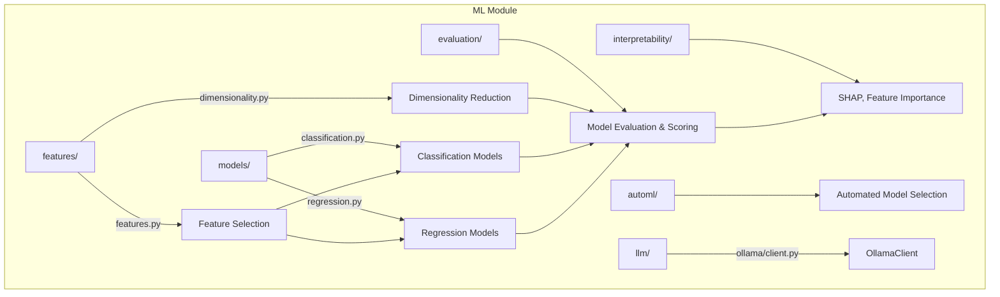

# ML Module

Machine learning pipelines for biological data -- classification, regression, feature engineering, dimensionality reduction, and local LLM inference.

## Architecture



## Key Capabilities

### Feature Selection

| Function | Description |
|----------|-------------|
| `select_features_univariate` | ANOVA F-test, chi-squared, mutual information |
| `select_features_recursive` | Recursive feature elimination (RFE/RFECV) |
| `select_features_stability` | Stability-based selection across resamples |
| `biological_feature_ranking` | Domain-aware ranking for omics data |
| `evaluate_feature_selection` | Compare selection methods on held-out data |

### Dimensionality Reduction

```python
from metainformant.ml.features.dimensionality import pca_reduction, umap_reduction

X_pca, pca_model = pca_reduction(X, n_components=10, scale_data=True)
X_umap = umap_reduction(X, n_components=2, n_neighbors=15)
```

### Local LLM Inference

```python
from metainformant.ml.llm.ollama.client import OllamaClient

client = OllamaClient(base_url="http://localhost:11434")
response = client.generate("Summarize this gene annotation", model="llama3")
print(response.text, response.tokens_per_second)
```

## Submodules

| Module | Purpose |
|--------|---------|
| [`features/`](features/) | Feature selection (`select_features_univariate`, `biological_feature_ranking`) and dimensionality reduction (`pca_reduction`, `umap_reduction`, `tsne_reduction`) |
| [`models/`](models/) | Classification and regression model wrappers |
| [`evaluation/`](evaluation/) | Model scoring, cross-validation, metrics |
| [`interpretability/`](interpretability/) | SHAP values, feature importance analysis |
| [`automl/`](automl/) | Automated model selection and hyperparameter tuning |
| [`llm/`](llm/) | Local LLM inference via `OllamaClient` (generate, chat, streaming) |

## Quick Start

```python
from metainformant.ml.features.features import select_features_univariate
from metainformant.ml.features.dimensionality import pca_reduction
import numpy as np

# Feature selection on expression matrix
X = np.random.randn(100, 500)  # 100 samples, 500 genes
y = np.array([0] * 50 + [1] * 50)

X_selected, indices = select_features_univariate(X, y, method="f_classif", k=50)

# Reduce dimensions for visualization
X_pca, model = pca_reduction(X_selected, n_components=2)
```

## Integration

- Expression matrices from [`metainformant.rna`](../rna/) feed into feature selection
- Dimensionality reduction outputs visualized with [`metainformant.visualization`](../visualization/)
- LLM inference supports annotation tasks across all domains

## Related

- [`metainformant.visualization.analysis`](../visualization/analysis/) -- PCA/UMAP plots
- [`metainformant.information`](../information/) -- Information-theoretic feature metrics
- [`docs/ml/`](../../../docs/ml/) -- ML documentation
