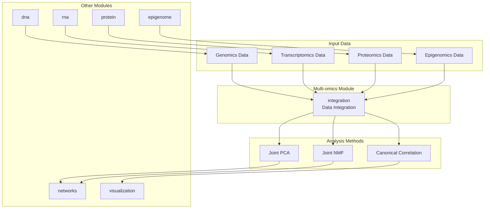
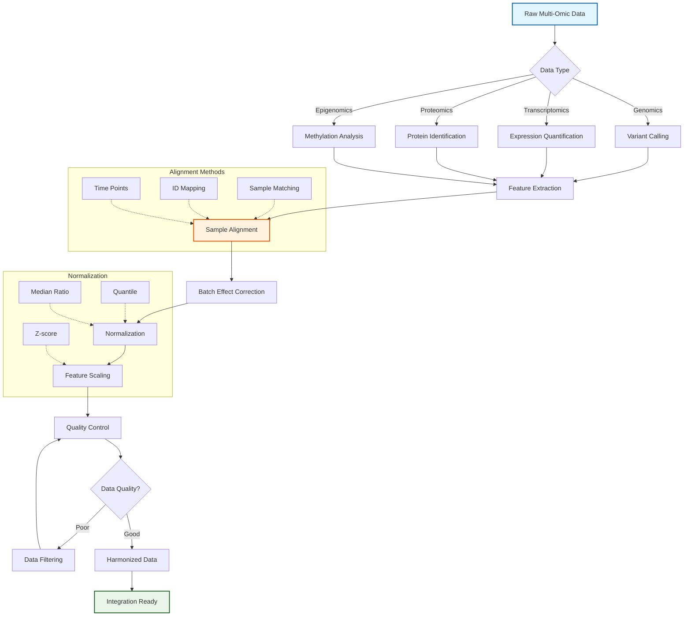
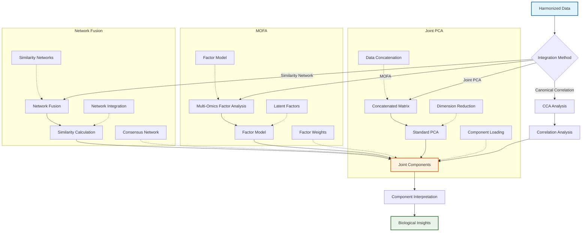
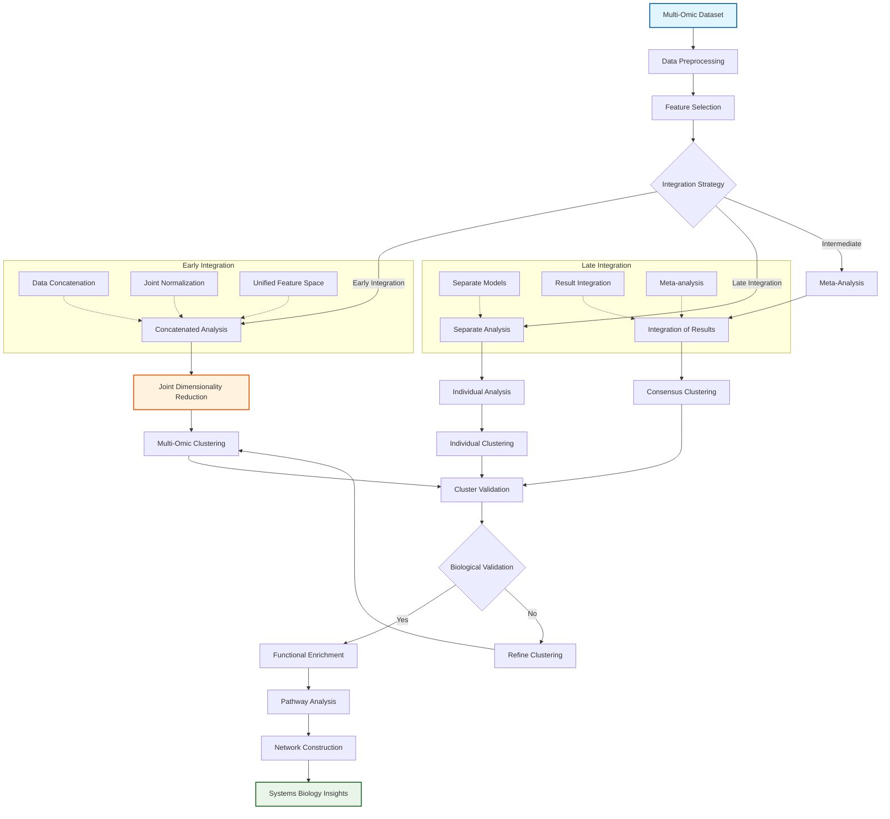
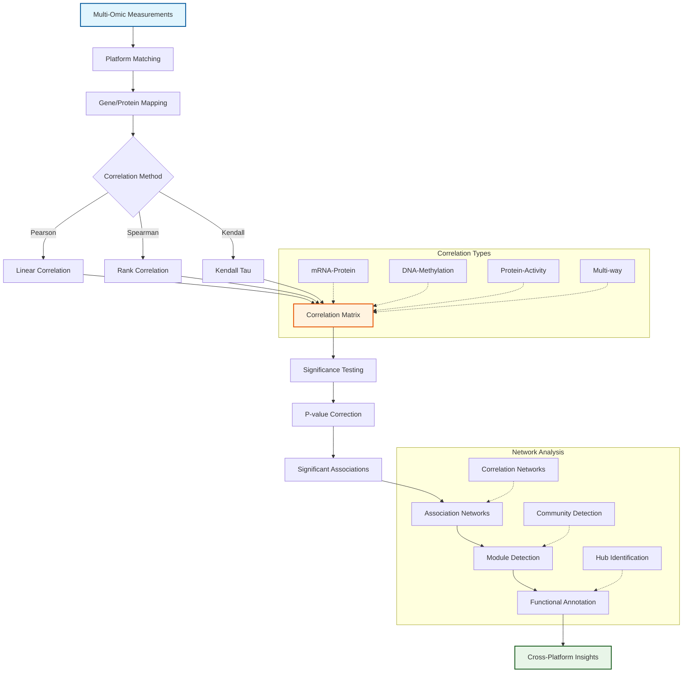

# Multi-Omics Integration Module

The `multiomics` module provides tools for integrating and analyzing data from multiple omic layers including genomics, transcriptomics, proteomics, metabolomics, and epigenomics.

## Overview

This module enables systems-level biological analysis by combining data from different molecular layers to understand complex biological processes. It handles sample alignment, data harmonization, and provides joint analysis methods for multi-omic datasets.

### Module Architecture



### Multi-Omics Data Harmonization



### Multi-Omics Integration Methods



### Multi-Omics Analysis Pipeline



### Cross-Platform Correlation Analysis


    PCA --> Integrate[Integration Analysis]
    NMF --> Integrate
    CCA --> Integrate
    Integrate --> Output[Results]
```

## Key Components

### Data Integration (`integration.py`)
Framework for combining heterogeneous biological datasets with automatic sample alignment.

**Key Features:**
- Automatic sample alignment across omics layers
- Support for multiple file formats (CSV, TSV, Excel)
- Sample and feature ID mapping
- Metadata integration

**Usage:**
```python
from metainformant.multiomics import MultiOmicsData, integrate_omics_data
import pandas as pd

# Create multi-omics data object
genomics = pd.DataFrame(np.random.randn(10, 100), index=[f"S{i}" for i in range(10)])
transcriptomics = pd.DataFrame(np.random.randn(10, 200), index=[f"S{i}" for i in range(10)])

omics_data = MultiOmicsData(genomics=genomics, transcriptomics=transcriptomics)
print(f"Aligned samples: {omics_data.n_samples}")
print(f"Available layers: {omics_data.layer_names}")

# Or integrate from file paths (paths must point to CSV/TSV files)
data_dict = {
    "genomics": "path/to/genomics.csv",
    "transcriptomics": "path/to/expression.tsv"
}
integrated = integrate_omics_data(data_dict)
```

### Joint Analysis Methods

#### Joint Principal Component Analysis (`joint_pca`)
Performs PCA on concatenated features from multiple omics layers.

```python
from metainformant.multiomics import joint_pca

# Joint PCA with optional layer weights
embeddings, loadings, variance = joint_pca(
    omics_data,
    n_components=50,
    layer_weights={"genomics": 1.0, "transcriptomics": 2.0},
    standardize=True
)

print(f"Joint embeddings shape: {embeddings.shape}")
print(f"Explained variance: {variance[:5]}")
```

#### Joint Non-negative Matrix Factorization (`joint_nmf`)
Factorizes each omics layer with shared sample factors.

```python
from metainformant.multiomics import joint_nmf

# Joint NMF with regularization
W, H = joint_nmf(
    omics_data,
    n_components=20,
    max_iter=200,
    regularization=0.01,
    random_state=42
)

# W: shared sample factors (n_samples x n_components)
# H: layer-specific feature factors
print(f"Sample factors shape: {W.shape}")
print(f"Genomics feature factors: {H['genomics'].shape}")
```

#### Canonical Correlation Analysis (`canonical_correlation`)
Finds maximally correlated patterns between two omics layers.

```python
from metainformant.multiomics import canonical_correlation

# CCA between genomics and transcriptomics
X_c, Y_c, X_w, Y_w, correlations = canonical_correlation(
    omics_data,
    layer_pair=("genomics", "transcriptomics"),
    n_components=10,
    regularization=0.01
)

print(f"Canonical correlations: {correlations}")
print(f"First canonical variate correlation: {correlations[0]}")
```

**Key Features:**
- Multi-omic dimensionality reduction
- Cross-omic pattern discovery
- Integrative biomarker identification
- Sample stratification across omics

## Integration with Other Modules

### With DNA, RNA, and Protein Modules
```python
from metainformant.multiomics import (
    MultiOmicsData,
    from_dna_variants,
    from_rna_expression,
    from_protein_abundance,
)

# Use helper functions to load data from domain modules
# Genomics: variant data from VCF file
genomics_df = from_dna_variants("variants.vcf")

# Transcriptomics: expression data from RNA module
transcriptomics_df = from_rna_expression("expression.tsv")

# Proteomics: protein abundance from CSV file
proteomics_df = from_protein_abundance("proteins.csv")

# Integrate all omics layers
omics_data = MultiOmicsData(
    genomics=genomics_df,
    transcriptomics=transcriptomics_df,
    proteomics=proteomics_df
)

# Save integrated data
omics_data.save("output/multiomics_integrated")
```

### Saving and Loading Data
```python
from metainformant.multiomics import MultiOmicsData

# Save multi-omics data to directory
omics_data.save("output/multiomics_data")

# Load saved data
loaded_data = MultiOmicsData.load("output/multiomics_data")
```

### With Epigenome Data
```python
from metainformant.multiomics import MultiOmicsData, canonical_correlation
from metainformant.core import io
import pandas as pd

# Load epigenomics data (assuming it's in CSV/TSV format)
methylation_df = io.read_csv("methylation.tsv", index_col=0, sep="\t")
expression_df = io.read_csv("expression.tsv", index_col=0, sep="\t")

# Create multi-omics dataset
omics_data = MultiOmicsData(
    epigenomics=methylation_df,
    transcriptomics=expression_df
)

# Canonical correlation between methylation and expression
X_c, Y_c, X_w, Y_w, correlations = canonical_correlation(
    omics_data,
    layer_pair=("epigenomics", "transcriptomics"),
    n_components=10
)
print(f"Max canonical correlation: {correlations[0]:.3f}")
```

### With Visualization Module
```python
from metainformant.multiomics import joint_pca
from metainformant.visualization import scatter_plot, heatmap

# Visualize joint PCA results
embeddings, loadings, variance = joint_pca(omics_data, n_components=2)

# Scatter plot of first two components
ax = scatter_plot(embeddings[:, 0], embeddings[:, 1],
                  xlabel="PC1", ylabel="PC2",
                  title="Joint PCA: Multi-Omics Integration")

# Heatmap of loadings across omics layers
ax = heatmap(loadings, title="Joint PCA Loadings")
```

## Limitations and Considerations

### Memory Requirements
- Large datasets may require significant memory. Consider subsetting data before analysis.
- Joint PCA/NMF with large feature matrices can be memory-intensive.
- Use `subset_samples()` or `subset_features()` to reduce data size if needed.

### Sample Size Requirements
- Joint PCA requires at least 2 samples
- Joint NMF requires at least 2 samples
- CCA requires at least 3 samples
- n_components is automatically capped to min(n_samples, n_features) - 1

### Data Requirements
- All data must be numeric (non-numeric columns trigger warnings)
- Missing values should be handled before integration (no built-in imputation)
- Samples must be aligned across all omics layers (automatic alignment performed)
- File formats: CSV, TSV, Excel (.xlsx, .xls). Gzip compression automatically handled.

### Performance Considerations
- Joint PCA: O(n_features²) memory complexity for covariance matrix
- Joint NMF: Iterative optimization, may be slow for large datasets
- CCA: Requires matrix inversions, may fail for singular matrices (fallback to SVD)

## Troubleshooting

### Common Issues

**"No common samples found across omics layers"**
- Check that sample IDs match across all layers
- Use `sample_mapping` parameter in `integrate_omics_data()` to harmonize IDs

**"n_components exceeds max"**
- Automatically capped, but check if you need fewer components
- Reduce n_components if you want to control dimensionality

**"Covariance matrix contains NaN or Inf"**
- Check for missing values in input data
- Ensure all values are numeric
- Consider data normalization before integration

**Memory errors with large datasets**
- Use `subset_samples()` or `subset_features()` to reduce data size
- Process in batches if possible
- Consider using sparse matrices for very large datasets (future enhancement)

## Testing

Comprehensive tests cover:
- Integration algorithm correctness
- Multi-omic data compatibility
- Edge cases (single sample, empty data, etc.)
- Error handling and validation
- Integration with core.io and logging

Run tests:
```bash
uv run pytest tests/test_multiomics_*.py -v
```

## Dependencies

- **Core**: numpy, pandas, metainformant.core (io, logging, paths)
- **Optional**: For integration helpers - DNA, RNA, protein, GWAS modules
- **File I/O**: Automatic gzip support via core.io

## Output Location

All outputs should be written to `output/multiomics/` directory by default. Use the `save()` method which automatically handles path creation and uses core.io for file operations.

This module enables systems biology analysis through multi-omic data integration.
