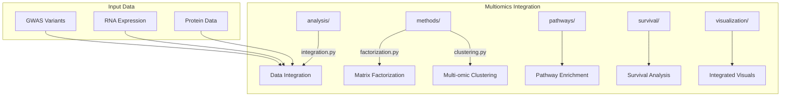

# Multiomics Integration Module

Core multi-omics data integration for combining GWAS, RNA-seq, proteomics, and epigenomics data layers.

## 📊 Architecture



## 🔑 Key Capabilities

### GWAS-Expression (eQTL) Integration

Combine genetic variants with gene expression to identify regulatory mechanisms:

```python
from metainformant.gwas.finemapping import eqtl_coloc
from metainformant.multiomics.analysis import integration

# Prepare expression data for integration
rna_data = integration.from_rna_expression(expression_df, normalize=True)

# Prepare variant data
dna_data = integration.from_dna_variants(vcf_df)

# Run colocalization analysis
result = eqtl_coloc(
    gwas_z=[1.2, 2.5, 3.1, 0.8],  # GWAS Z-scores
    eqtl_z=[1.1, 2.3, 2.9, 0.5],  # eQTL Z-scores
    gene_id="LOC12345"
)
```

### Integration Methods

| Method | Function | Use Case |
|--------|----------|----------|
| `integrate_omics_data()` | Unified integration | Combine DNA/RNA/protein |
| `joint_pca()` | Joint dimensionality reduction | Find shared patterns |
| `joint_nmf()` | Non-negative factorization | Identify positive factors |
| `canonical_correlation()` | CCA | Correlate two data layers |

### Data Converters

| Function | Purpose |
|----------|---------|
| `from_dna_variants()` | VCF → integration-ready format |
| `from_rna_expression()` | Expression data normalization |
| `from_protein_abundance()` | Proteomics preprocessing |
| `from_epigenome_data()` | Methylation/ChIP-seq data |

## 📦 Submodules

| Module | Purpose |
|--------|---------|
| [`analysis/`](analysis/) | Core integration algorithms |
| [`methods/`](methods/) | Factorization, clustering |
| [`pathways/`](pathways/) | Multi-omic pathway analysis |
| [`survival/`](survival/) | Cox, Kaplan-Meier models |
| [`visualization/`](visualization/) | Integrated plots |

## 🧬 Species-Agnostic Design

All methods are species-agnostic. Example with *Apis mellifera*:

```python
# Works with any species - just provide the data
multiomics = integration.integrate_omics_data(
    dna_data=apis_variants_df,      # Any species VCF data
    rna_data=apis_expression_df,    # Any species expression
)
```

## 🔗 Related

- [metainformant.gwas](../gwas/) - GWAS analysis and fine-mapping
- [metainformant.rna](../rna/) - RNA-seq quantification
- [docs/multiomics/](../../../docs/multiomics/) - Extended documentation
