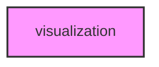

# VISUALIZATION

## Overview
Functionality for visualization.

## 📦 Contents
- `[__init__.py](__init__.py)`
- `[visualization.py](visualization.py)`

## 📊 Structure



## Usage
Import module:
```python
from metainformant.metainformant.multiomics.visualization import ...
```
